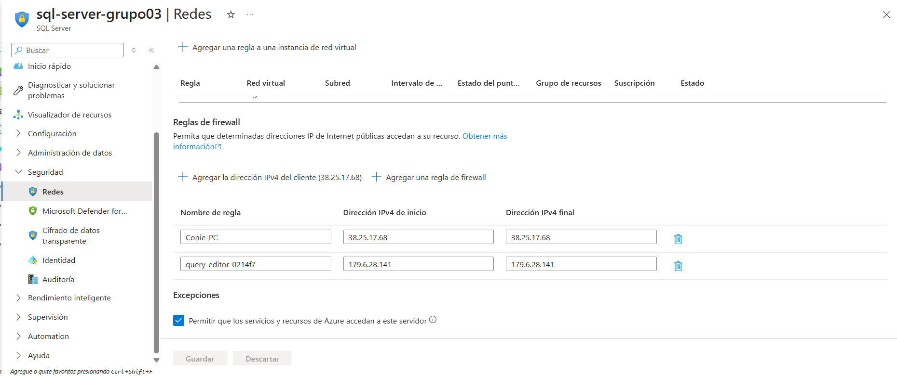
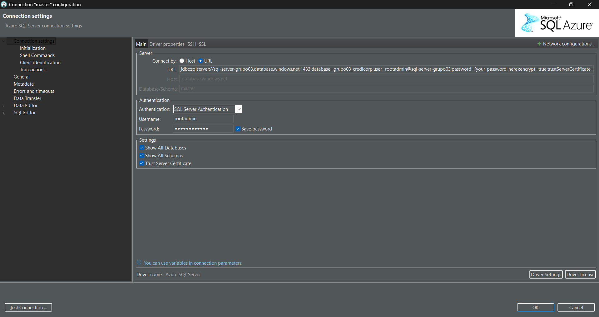
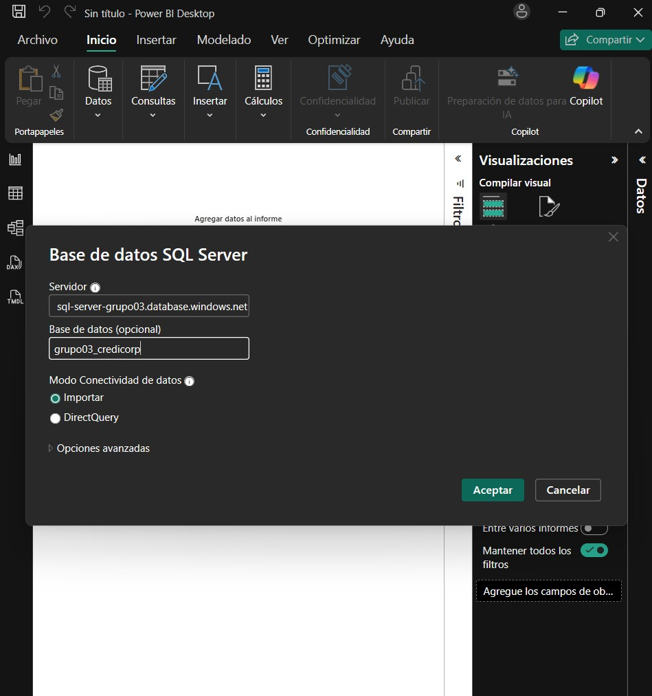
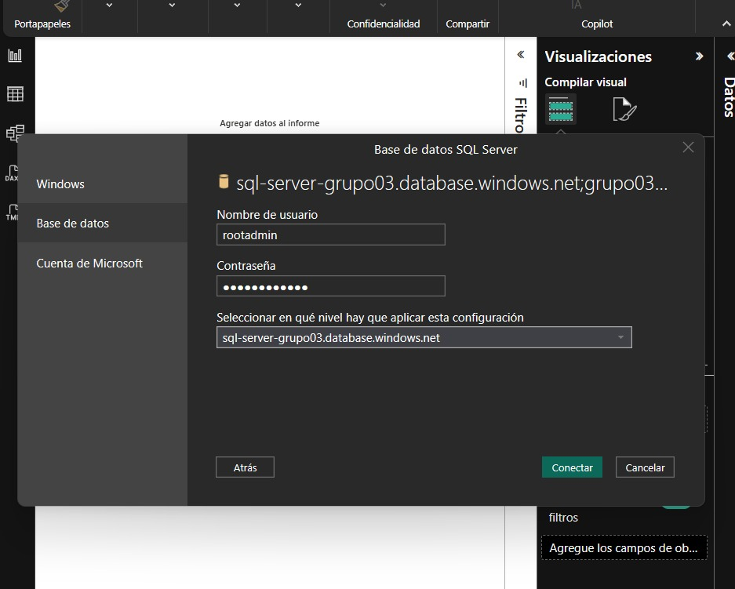

# Estructura de Base de Datos SQL 

## 1. Información General

**Proyecto:** Dashboard de Análisis Financiero en Power BI  
**Base de Datos:** Azure SQL Database  
**Propósito:** Almacenamiento y procesamiento de datos financieros para análisis de KPIs bancarios    

---

## 2. Arquitectura de Datos

### 2.1 Origen de Datos

Los datos provienen de archivos CSV almacenados en Azure Storage:

- **Recurso Azure:** Cuenta de Almacenamiento
- **Ubicación:** Contenedores de blobs → `/trusteddata`
- **Formato:** CSV con información de estados financieros


### 2.2 Flujo de Datos

```
CSV (Azure Blob Storage) 
    ↓
estados_financieros (Tabla Base)
    ↓
    ├→ empresa_financiera
    ├→ calendario
    ├→ cuentas_contables
    └→ kpi_financiero (generado vía stored procedure)
```

---

## 3. Prerrequisitos

### 3.1 Para conectar DBeaver con Azure SQL Server

Primero agregamos nuestra dirección IP a los permisos de Azure:



Luego en DBeaver se genera la conexión al servidor



### 3.1 Tabla Base Requerida

Antes de ejecutar los scripts de este documento, debe existir y estar poblada la siguiente tabla:

**Tabla:** `estados_financieros`

Esta tabla se alimenta directamente del CSV ubicado en Azure Blob Storage y sirve como fuente única de verdad para todas las demás tablas del modelo.

**Proceso de carga:** Se utiliza un [pipeline de carga](./Pipeline_csv_to_db.JSON) para poblar esta tabla desde el CSV.

---

## 4. Estructura de Tablas

### 4.1 Tabla: `estados_financieros` (Tabla Base)

**Descripción:** Almacena toda la información contable y financiera extraída de los archivos CSV.

**Script de Creación:**

```sql
CREATE TABLE estados_financieros (
    codigo_cuenta VARCHAR(13),
    nombre_cuenta VARCHAR(231) NOT NULL,
    valor_cuenta NUMERIC(12,2),
    tipo_cuenta ENUM(
        'Activo',
        'Pasivo',
        'Patrimonio',
        'Ingresos',
        'Gastos',
        'Contingentes',
        'Cuentas_Resultado',
        'Cuentas_Origen'
    ) NOT NULL,
    tipo_estado_financiero ENUM('bg','gyp') NOT NULL,
    nombre_empresa VARCHAR(200),
    fecha CHAR(7)
);
```

**Campos:**
- `codigo_cuenta`: Código único de la cuenta contable
- `nombre_cuenta`: Nombre de la cuenta contable
- `valor_cuenta`: Monto de la cuenta
- `tipo_cuenta`: Clasificación contable
- `tipo_estado_financiero`: 'bg' (Balance General) o 'gyp' (Ganancias y Pérdidas)
- `nombre_empresa`: Nombre de la entidad financiera
- `fecha`: Período en formato YYYYMM (ej: 2024-01)

**Población:** Ver [script de carga](./Pipeline_csv_to_db.JSON)

---

### 4.2 Tabla: `cuentas_contables`

**Descripción:** Catálogo maestro del plan de cuentas contables con estructura jerárquica.

**Script de Creación:**

```sql
CREATE TABLE cuentas_contables (
    codigo_cuenta VARCHAR(13) PRIMARY KEY,
    nombre_cuenta VARCHAR(231) NOT NULL,
    nivel_cuenta INTEGER(1) NOT NULL,
    tipo_cuenta ENUM(
        'Activo',
        'Pasivo',
        'Patrimonio',
        'Ingresos',
        'Gastos',
        'Contingentes',
        'Cuentas_Resultado',
        'Cuentas_Origen'
    ) NOT NULL,
    cuenta_padre VARCHAR(10) NULL,
    FOREIGN KEY (cuenta_padre) REFERENCES cuentas_contables(codigo_cuenta)
);
```

**Campos:**
- `codigo_cuenta`: Código único (PK)
- `nombre_cuenta`: Nombre descriptivo
- `nivel_cuenta`: Nivel jerárquico (1-9)
- `tipo_cuenta`: Clasificación contable
- `cuenta_padre`: Código de cuenta superior (FK autorreferencial)

**Script de Población:**
```sql
INSERT INTO cuentas_contables VALUES ('1','activo',1,'Activo',NULL);
INSERT INTO cuentas_contables VALUES ('11','disponible',2,'Activo','1');
INSERT INTO cuentas_contables VALUES ('1101','caja',3,'Activo','11');
INSERT INTO cuentas_contables VALUES ('1103','bancos_y_corresponsales',3,'Activo','11');
INSERT INTO cuentas_contables VALUES ('1105','canje',3,'Activo','11');
INSERT INTO cuentas_contables VALUES ('1109','otros',3,'Activo','11');
INSERT INTO cuentas_contables VALUES ('12','fondos_interbancarios',2,'Activo','1');
INSERT INTO cuentas_contables VALUES ('13','inversiones_netas_de_provisiones',2,'Activo','1');
INSERT INTO cuentas_contables VALUES ('1301','inversiones_a_valor_razonable_con_cambios_en_resultados',3,'Activo','13');
INSERT INTO cuentas_contables VALUES ('1303','inversiones_disponibles_para_la_venta',3,'Activo','13');
INSERT INTO cuentas_contables VALUES ('1305','inversiones_a_vencimiento',3,'Activo','13');
INSERT INTO cuentas_contables VALUES ('17','inversiones_en_subsidiarias_asociadas_y_negocios_conjuntos',3,'Activo','13');
INSERT INTO cuentas_contables VALUES ('1306','inversiones_en_commodities',3,'Activo','13');
INSERT INTO cuentas_contables VALUES ('1309','provisiones',3,'Activo','13');
INSERT INTO cuentas_contables VALUES ('14','creditos_netos_de_provisiones_y_de_ingresos_no_devengados',2,'Activo','1');
INSERT INTO cuentas_contables VALUES ('1401','vigentes',3,'Activo','14');
INSERT INTO cuentas_contables VALUES ('1401.07.01','cuentas_corrientes',4,'Activo','1401');
INSERT INTO cuentas_contables VALUES ('1401.07.02','tarjetas_de_credito',4,'Activo','1401');
INSERT INTO cuentas_contables VALUES ('1401.07.05','descuentos',4,'Activo','1401');
INSERT INTO cuentas_contables VALUES ('1401.07.10','factoring',4,'Activo','1401');
INSERT INTO cuentas_contables VALUES ('1401.07.06','prestamos',4,'Activo','1401');
INSERT INTO cuentas_contables VALUES ('1401.07.11','arrendamiento_financiero',4,'Activo','1401');
INSERT INTO cuentas_contables VALUES ('1401.04','hipotecarios_para_vivienda',4,'Activo','1401');
INSERT INTO cuentas_contables VALUES ('1401.07.26','comercio_exterior',4,'Activo','1401');
INSERT INTO cuentas_contables VALUES ('1401.07.21','creditos_por_liquidar',4,'Activo','1401');
INSERT INTO cuentas_contables VALUES ('1401.04.99','otros',4,'Activo','1401');
INSERT INTO cuentas_contables VALUES ('1403','refinanciados_y_reestructurados',3,'Activo','14');
INSERT INTO cuentas_contables VALUES ('1404','atrasados',3,'Activo','14');
INSERT INTO cuentas_contables VALUES ('1405','vencidos',4,'Activo','1404');
INSERT INTO cuentas_contables VALUES ('1406','en_cobranza_judicial',4,'Activo','1404');
INSERT INTO cuentas_contables VALUES ('1409','provisiones',3,'Activo','14');
INSERT INTO cuentas_contables VALUES ('1410','intereses_y_comisiones_no_devengados',3,'Activo','14');
INSERT INTO cuentas_contables VALUES ('15','cuentas_por_cobrar_netas_de_provisiones',2,'Activo','1');
INSERT INTO cuentas_contables VALUES ('1508','rendimientos_por_cobrar',2,'Activo','1');
INSERT INTO cuentas_contables VALUES ('1508.11','disponible',3,'Activo','1508');
INSERT INTO cuentas_contables VALUES ('1508.12','fondos_interbancarios',3,'Activo','1508');
INSERT INTO cuentas_contables VALUES ('1508.13','inversiones',3,'Activo','1508');
INSERT INTO cuentas_contables VALUES ('1508.14','creditos',3,'Activo','1508');
INSERT INTO cuentas_contables VALUES ('1508.15','cuentas_por_cobrar',3,'Activo','1508');
INSERT INTO cuentas_contables VALUES ('16','bienes_realizables_recibidos_en_pago_y_adjudicados_netos',2,'Activo','1');
INSERT INTO cuentas_contables VALUES ('18','inmuebles_mobiliario_y_equipo_neto',2,'Activo','1');
INSERT INTO cuentas_contables VALUES ('19','otros_activos',2,'Activo','1');
INSERT INTO cuentas_contables VALUES ('2','pasivo',1,'Pasivo',NULL);
INSERT INTO cuentas_contables VALUES ('21','obligaciones_con_el_publico',2,'Pasivo','2');
INSERT INTO cuentas_contables VALUES ('2101','depositos_a_la_vista',3,'Pasivo','21');
INSERT INTO cuentas_contables VALUES ('2102','depositos_de_ahorro',3,'Pasivo','21');
INSERT INTO cuentas_contables VALUES ('2103','depositos_a_plazo',3,'Pasivo','21');
INSERT INTO cuentas_contables VALUES ('2103.02','certificados_bancarios_y_de_depositos',4,'Pasivo','2103');
INSERT INTO cuentas_contables VALUES ('2103.03','cuentas_a_plazo',4,'Pasivo','2103');
INSERT INTO cuentas_contables VALUES ('2103.05','cts',4,'Pasivo','2103');
INSERT INTO cuentas_contables VALUES ('2103.09','otros',4,'Pasivo','2103');
INSERT INTO cuentas_contables VALUES ('2107','depositos_restringidos',3,'Pasivo','21');
INSERT INTO cuentas_contables VALUES ('2108','otras_obligaciones',3,'Pasivo','21');
INSERT INTO cuentas_contables VALUES ('2108.01','a_la_vista',4,'Pasivo','2108');
INSERT INTO cuentas_contables VALUES ('2108.02','relacionadas_con_inversiones',4,'Pasivo','2108');
INSERT INTO cuentas_contables VALUES ('23','depositos_del_sistema_financiero_y_organismos_internacionales',2,'Pasivo','2');
INSERT INTO cuentas_contables VALUES ('2301','depositos_a_la_vista',3,'Pasivo','23');
INSERT INTO cuentas_contables VALUES ('2302','depositos_de_ahorro',3,'Pasivo','23');
INSERT INTO cuentas_contables VALUES ('2303','depositos_a_plazo',3,'Pasivo','23');
INSERT INTO cuentas_contables VALUES ('22','fondos_interbancarios',2,'Pasivo','2');
INSERT INTO cuentas_contables VALUES ('24','adeudos_y_obligaciones_financieras',2,'Pasivo','2');
INSERT INTO cuentas_contables VALUES ('2403','instituciones_del_pais',3,'Pasivo','24');
INSERT INTO cuentas_contables VALUES ('2405','instituciones_del_exterior_y_organismos_internacionales',3,'Pasivo','24');
INSERT INTO cuentas_contables VALUES ('2808','obligaciones_en_circulacion_no_subordinadas',2,'Pasivo','2');
INSERT INTO cuentas_contables VALUES ('2804','bonos_de_arrendamiento_financiero',3,'Pasivo','2808');
INSERT INTO cuentas_contables VALUES ('2805','instrumentos_hipotecarios',3,'Pasivo','2808');
INSERT INTO cuentas_contables VALUES ('2807','otros_instrumentos_de_deuda',3,'Pasivo','2808');
INSERT INTO cuentas_contables VALUES ('25','cuentas_por_pagar',2,'Pasivo','2');
INSERT INTO cuentas_contables VALUES ('2001','intereses_y_otros_gastos_por_pagar',2,'Pasivo','2');
INSERT INTO cuentas_contables VALUES ('2001.21','obligaciones_con_el_publico',3,'Pasivo','2001');
INSERT INTO cuentas_contables VALUES ('2001.23','depositos_del_sistema_financiero_y_organismos_internacionales',3,'Pasivo','2001');
INSERT INTO cuentas_contables VALUES ('2001.22','fondos_interbancarios',3,'Pasivo','2001');
INSERT INTO cuentas_contables VALUES ('2001.24','adeudos_y_obligaciones_financieras',3,'Pasivo','2001');
INSERT INTO cuentas_contables VALUES ('2001.28','obligaciones_en_circulacion_no_subordinadas',3,'Pasivo','2001');
INSERT INTO cuentas_contables VALUES ('2001.25','cuentas_por_pagar',3,'Pasivo','2001');
INSERT INTO cuentas_contables VALUES ('29','otros_pasivos',2,'Pasivo','2');
INSERT INTO cuentas_contables VALUES ('27','provisiones',2,'Pasivo','2');
INSERT INTO cuentas_contables VALUES ('2701','creditos_indirectos',3,'Pasivo','27');
INSERT INTO cuentas_contables VALUES ('2702','otras_provisiones',3,'Pasivo','27');
INSERT INTO cuentas_contables VALUES ('28','obligaciones_en_circulacion_subordinadas',2,'Pasivo','2');
INSERT INTO cuentas_contables VALUES ('3','patrimonio',1,'Patrimonio',NULL);
INSERT INTO cuentas_contables VALUES ('31','capital_social',2,'Patrimonio','3');
INSERT INTO cuentas_contables VALUES ('32','capital_adicional',2,'Patrimonio','3');
INSERT INTO cuentas_contables VALUES ('33','reservas',2,'Patrimonio','3');
INSERT INTO cuentas_contables VALUES ('35','ajustes_al_patrimonio',2,'Patrimonio','3');
INSERT INTO cuentas_contables VALUES ('38','resultados_acumulados',2,'Patrimonio','3');
INSERT INTO cuentas_contables VALUES ('39','resultado_neto_del_ejercicio',2,'Patrimonio','3');
INSERT INTO cuentas_contables VALUES ('3901','total_pasivo_y_patrimonio',2,'Patrimonio','3');
INSERT INTO cuentas_contables VALUES ('7','contingentes',1,'Contingentes',NULL);
INSERT INTO cuentas_contables VALUES ('7101','avales_cartas_fianza_cartas_de_credito_y_aceptaciones_bancarias',3,'Contingentes','7');
INSERT INTO cuentas_contables VALUES ('7105','lineas_de_credito_no_utilizadas_y_creditos_concedidos_no_desembolsados',3,'Contingentes','7');
INSERT INTO cuentas_contables VALUES ('7106','instrumentos_financieros_derivados',3,'Contingentes','7');
INSERT INTO cuentas_contables VALUES ('7110','otras_cuentas_contingentes',3,'Contingentes','7');
INSERT INTO cuentas_contables VALUES ('5','ingresos',1,'Ingresos',NULL);
INSERT INTO cuentas_contables VALUES ('51','ingresos_financieros',2,'Ingresos','5');
INSERT INTO cuentas_contables VALUES ('5101','disponible',3,'Ingresos','51');
INSERT INTO cuentas_contables VALUES ('5102','fondos_interbancarios',3,'Ingresos','51');
INSERT INTO cuentas_contables VALUES ('5103','inversiones',3,'Ingresos','51');
INSERT INTO cuentas_contables VALUES ('5104','creditos_directos',3,'Ingresos','51');
INSERT INTO cuentas_contables VALUES ('5106','ganancias_por_valorizacion_de_inversiones',3,'Ingresos','51');
INSERT INTO cuentas_contables VALUES ('5107','ganancias_por_inversiones_en_subsidiarias_asociadas_y_negocios_conjuntos',3,'Ingresos','51');
INSERT INTO cuentas_contables VALUES ('5108','diferencia_de_cambio',3,'Ingresos','51');
INSERT INTO cuentas_contables VALUES ('5109','ganancias_en_productos_financieros_derivados',3,'Ingresos','51');
INSERT INTO cuentas_contables VALUES ('5110','otros',3,'Ingresos','51');
INSERT INTO cuentas_contables VALUES ('4','gastos',1,'Gastos',NULL);
INSERT INTO cuentas_contables VALUES ('41','gastos_financieros',2,'Gastos','4');
INSERT INTO cuentas_contables VALUES ('4101','obligaciones_con_el_publico',3,'Gastos','41');
INSERT INTO cuentas_contables VALUES ('4103','depositos_del_sistema_financiero_y_organismos_financieros_internacionales',3,'Gastos','41');
INSERT INTO cuentas_contables VALUES ('4102','fondos_interbancarios',3,'Gastos','41');
INSERT INTO cuentas_contables VALUES ('4104','adeudos_y_obligaciones_financieras',3,'Gastos','41');
INSERT INTO cuentas_contables VALUES ('4106','obligaciones_en_circulacion_no_subordinadas',3,'Gastos','41');
INSERT INTO cuentas_contables VALUES ('4105','obligaciones_en_circulacion_subordinadas',3,'Gastos','41');
INSERT INTO cuentas_contables VALUES ('4109.01','perdida_por_valorizacion_de_inversiones',3,'Gastos','41');
INSERT INTO cuentas_contables VALUES ('4109.04','perdidas_por_inversiones_en_subsidiarias_asociadas_y_negocios_conjuntos',3,'Gastos','41');
INSERT INTO cuentas_contables VALUES ('4109.05','primas_al_fondo_de_seguro_de_depositos',3,'Gastos','41');
INSERT INTO cuentas_contables VALUES ('4108','diferencia_de_cambio',3,'Gastos','41');
INSERT INTO cuentas_contables VALUES ('4109.02','perdidas_en_productos_financieros_derivados',3,'Gastos','41');
INSERT INTO cuentas_contables VALUES ('4109.99','otros',3,'Gastos','41');
INSERT INTO cuentas_contables VALUES ('6','cuentas_de_resultado',1,'Cuentas_Resultado',NULL);
INSERT INTO cuentas_contables VALUES ('61','margen_financiero_bruto',2,'Cuentas_Resultado','6');
INSERT INTO cuentas_contables VALUES ('62','provisiones_para_creditos_directos',2,'Cuentas_Resultado','6');
INSERT INTO cuentas_contables VALUES ('63','margen_financiero_neto',2,'Cuentas_Resultado','6');
INSERT INTO cuentas_contables VALUES ('52','ingresos_por_servicios_financieros',2,'Ingresos','5');
INSERT INTO cuentas_contables VALUES ('5202.02','cuentas_por_cobrar',3,'Ingresos','52');
INSERT INTO cuentas_contables VALUES ('5201','creditos_indirectos',3,'Ingresos','52');
INSERT INTO cuentas_contables VALUES ('5202.04','fideicomisos_y_comisiones_de_confianza',3,'Ingresos','52');
INSERT INTO cuentas_contables VALUES ('5202','ingresos_diversos',3,'Ingresos','52');
INSERT INTO cuentas_contables VALUES ('42','gastos_por_servicios_financieros',2,'Gastos','4');
INSERT INTO cuentas_contables VALUES ('4202.02','cuentas_por_pagar',3,'Gastos','42');
INSERT INTO cuentas_contables VALUES ('4202.07','creditos_indirectos',3,'Gastos','42');
INSERT INTO cuentas_contables VALUES ('4202.04','fideicomisos_y_comisiones_de_confianza',3,'Gastos','42');
INSERT INTO cuentas_contables VALUES ('4202.3','gastos_diversos',3,'Gastos','42');
INSERT INTO cuentas_contables VALUES ('64','utilidad_perdida_por_venta_de_cartera',2,'Cuentas_Resultado','6');
INSERT INTO cuentas_contables VALUES ('65','margen_operacional',2,'Cuentas_Resultado','6');
INSERT INTO cuentas_contables VALUES ('45','gastos_administrativos',2,'Gastos','4');
INSERT INTO cuentas_contables VALUES ('4501','personal',3,'Gastos','45');
INSERT INTO cuentas_contables VALUES ('4502','directorio',3,'Gastos','45');
INSERT INTO cuentas_contables VALUES ('4503','servicios_recibidos_de_terceros',3,'Gastos','45');
INSERT INTO cuentas_contables VALUES ('4504','impuestos_y_contribuciones',3,'Gastos','45');
INSERT INTO cuentas_contables VALUES ('6901','margen_operacional_neto',2,'Cuentas_Resultado','6');
INSERT INTO cuentas_contables VALUES ('43','provisiones_depreciacion_y_amortizacion',2,'Gastos','4');
INSERT INTO cuentas_contables VALUES ('4302','provisones_para_creditos_indirectos',3,'Gastos','43');
INSERT INTO cuentas_contables VALUES ('4301','provisiones_por_perdida_por_deterioro_de_inversiones',3,'Gastos','43');
INSERT INTO cuentas_contables VALUES ('4303','provisiones_para_incobrabilidad_de_cuentas_por_cobrar',3,'Gastos','43');
INSERT INTO cuentas_contables VALUES ('4304','provisiones_para_bienes_realizables_recibidos_en_pago_y_adjudicados',3,'Gastos','43');
INSERT INTO cuentas_contables VALUES ('4305','otras_provisiones',3,'Gastos','43');
INSERT INTO cuentas_contables VALUES ('8109.01','depreciacion',3,'Cuentas_Origen','43');
INSERT INTO cuentas_contables VALUES ('8109.02','amortizacion',3,'Cuentas_Origen','43');
INSERT INTO cuentas_contables VALUES ('56','otros_ingresos_y_gastos',2,'Ingresos','5');
INSERT INTO cuentas_contables VALUES ('66','resultado_antes_de_impuesto_a_la_renta',2,'Cuentas_Resultado','6');
INSERT INTO cuentas_contables VALUES ('68','impuesto_a_la_renta',2,'Cuentas_Resultado','6');
INSERT INTO cuentas_contables VALUES ('69','resultado_neto_del_ejercicio',2,'Cuentas_Resultado','6');
```


---

### 4.3 Tabla: `empresa_financiera`

**Descripción:** Catálogo de empresas financieras analizadas.

**Script de Creación:**

```sql
CREATE TABLE empresa_financiera (
    cod_empresa INT IDENTITY(1,1) PRIMARY KEY,
    nombre_empresa VARCHAR(54)
);
```

**Script de Población:**

```sql
INSERT INTO empresa_financiera (nombre_empresa)
SELECT DISTINCT nombre_empresa
FROM estados_financieros
WHERE nombre_empresa IS NOT NULL;
```

**Campos:**
- `cod_empresa`: Identificador único autoincremental (PK)
- `nombre_empresa`: Nombre de la entidad financiera

**Validación:**

```sql
SELECT * FROM empresa_financiera;
```

---

### 4.4 Tabla: `calendario`

**Descripción:** Dimensión de tiempo con desagregación en diferentes períodos.

**Script de Creación:**

```sql
CREATE TABLE calendario (
    id_fecha CHAR(10) PRIMARY KEY,
    nombre_mes VARCHAR(9),
    anio INT,
    semestre INT,
    cuatrimestre INT,
    trimestre INT,
    bimestre INT,
    mes INT
);
```

**Script de Población:**

```sql
INSERT INTO calendario (
    id_fecha, 
    nombre_mes, 
    anio, 
    semestre, 
    cuatrimestre, 
    trimestre, 
    bimestre, 
    mes
)
SELECT DISTINCT 
    fecha AS id_fecha,
    DATENAME(MONTH, DATEFROMPARTS(LEFT(fecha, 4), RIGHT(fecha, 2), 1)) AS nombre_mes,
    CAST(LEFT(fecha, 4) AS INT) AS anio,
    
    -- Semestre
    CASE 
        WHEN RIGHT(fecha, 2) BETWEEN '01' AND '06' THEN 1 
        ELSE 2 
    END AS semestre,
    
    -- Cuatrimestre
    CASE 
        WHEN RIGHT(fecha, 2) BETWEEN '01' AND '04' THEN 1
        WHEN RIGHT(fecha, 2) BETWEEN '05' AND '08' THEN 2
        ELSE 3 
    END AS cuatrimestre,
    
    -- Trimestre
    CASE 
        WHEN RIGHT(fecha, 2) BETWEEN '01' AND '03' THEN 1
        WHEN RIGHT(fecha, 2) BETWEEN '04' AND '06' THEN 2
        WHEN RIGHT(fecha, 2) BETWEEN '07' AND '09' THEN 3
        ELSE 4 
    END AS trimestre,
    
    -- Bimestre
    CASE 
        WHEN RIGHT(fecha, 2) IN ('01','02') THEN 1
        WHEN RIGHT(fecha, 2) IN ('03','04') THEN 2
        WHEN RIGHT(fecha, 2) IN ('05','06') THEN 3
        WHEN RIGHT(fecha, 2) IN ('07','08') THEN 4
        WHEN RIGHT(fecha, 2) IN ('09','10') THEN 5
        ELSE 6 
    END AS bimestre,
    
    CAST(RIGHT(fecha, 2) AS INT) AS mes
FROM estados_financieros
WHERE fecha IS NOT NULL;
```

**Campos:**
- `id_fecha`: Período en formato YYYYMM (PK)
- `nombre_mes`: Nombre del mes en texto
- `anio`: Año (4 dígitos)
- `semestre`: Semestre del año (1-2)
- `cuatrimestre`: Cuatrimestre del año (1-3)
- `trimestre`: Trimestre del año (1-4)
- `bimestre`: Bimestre del año (1-6)
- `mes`: Mes del año (1-12)

**Validación:**

```sql
SELECT * FROM calendario ORDER BY id_fecha;
```

---

### 4.5 Tabla: `kpi_financiero`

**Descripción:** Almacena los indicadores clave de rendimiento financiero calculados.

**Script de Creación:**

```sql
CREATE TABLE kpi_financiero (
    cod_empresa INT,
    id_fecha CHAR(10),
    ROA INT,
    ROE INT,
    NIM INT,
    cobertura_provisiones INT,
    Mora INT,
    indice_capital_total INT,
    PRIMARY KEY (cod_empresa, id_fecha),
    FOREIGN KEY (cod_empresa) REFERENCES empresa_financiera(cod_empresa),
    FOREIGN KEY (id_fecha) REFERENCES calendario(id_fecha)
);
```

**Campos:**
- `cod_empresa`: ID de la empresa (PK, FK)
- `id_fecha`: Período (PK, FK)
- `ROA`: Return on Assets (Rentabilidad sobre Activos) en %
- `ROE`: Return on Equity (Rentabilidad sobre Patrimonio) en %
- `NIM`: Net Interest Margin (Margen de Interés Neto) en %
- `cobertura_provisiones`: Cobertura de Provisiones en %
- `Mora`: Índice de Morosidad en %
- `indice_capital_total`: Índice de Capital Total en %

**Nota:** Los datos se generan mediante el procedimiento almacenado `generar_kpis`.

---

## 5. Procedimientos Almacenados

### 5.1 Procedimiento: `generar_kpis`

**Descripción:** Calcula y actualiza todos los KPIs financieros basándose en los datos de `estados_financieros`.

**Ejecución:** Debe ejecutarse cada vez que se cargue un CSV actualizado.

**Script Completo:**

```sql
CREATE OR ALTER PROCEDURE generar_kpis
AS
BEGIN
    -- Primero eliminamos KPIs anteriores
    DELETE FROM kpi_financiero;
    
    -- Luego se insertan los KPIs calculados con data actualizada
    INSERT INTO kpi_financiero (
        cod_empresa,
        id_fecha,
        ROA,
        ROE,
        NIM,
        cobertura_provisiones,
        Mora,
        indice_capital_total
    )
    SELECT 
        efi.cod_empresa,
        fin.fecha,
        
        -- ROA: Resultado Neto / Activo Total
        CASE 
            WHEN fin.activo <> 0 
            THEN (fin.resultado_neto / fin.activo) * 100 
            ELSE NULL 
        END AS ROA,
        
        -- ROE: Resultado Neto / Patrimonio
        CASE 
            WHEN fin.patrimonio <> 0 
            THEN (fin.resultado_neto / fin.patrimonio) * 100 
            ELSE NULL 
        END AS ROE,
        
        -- NIM: Margen Financiero Bruto / Activos Productivos
        CASE 
            WHEN (fin.disponible + fin.inversiones + ABS(fin.creditos)) <> 0 
            THEN (fin.margen_financiero_bruto / (fin.disponible + fin.inversiones + ABS(fin.creditos))) * 100 
            ELSE NULL 
        END AS NIM,
        
        -- Cobertura de Provisiones: Provisiones / Cartera Atrasada
        CASE 
            WHEN (fin.refinanciados + fin.vencidos + fin.cobranza_judicial) <> 0 
            THEN (fin.provisiones / (fin.refinanciados + fin.vencidos + fin.cobranza_judicial)) * 100 
            ELSE NULL 
        END AS cobertura_provisiones,
        
        -- Mora: Cartera Atrasada / Créditos Totales
        CASE 
            WHEN ABS(fin.creditos) <> 0 
            THEN ((fin.vencidos + fin.cobranza_judicial) / ABS(fin.creditos)) * 100 
            ELSE NULL 
        END AS Mora,
        
        -- Capital Total: Patrimonio / Activo Total
        CASE 
            WHEN fin.activo <> 0 
            THEN (fin.patrimonio / fin.activo) * 100 
            ELSE NULL 
        END AS indice_capital_total
        
    FROM (
        -- Subconsulta que pivotea los datos financieros
        SELECT 
            nombre_empresa,
            fecha,
            MAX(CASE WHEN codigo_cuenta = '69' THEN valor_cuenta END) AS resultado_neto,
            MAX(CASE WHEN codigo_cuenta = '1' THEN valor_cuenta END) AS activo,
            MAX(CASE WHEN codigo_cuenta = '3' THEN valor_cuenta END) AS patrimonio,
            MAX(CASE WHEN codigo_cuenta = '61' THEN valor_cuenta END) AS margen_financiero_bruto,
            MAX(CASE WHEN codigo_cuenta = '11' THEN valor_cuenta END) AS disponible,
            MAX(CASE WHEN codigo_cuenta = '13' THEN valor_cuenta END) AS inversiones,
            MAX(CASE WHEN codigo_cuenta = '1508.14' THEN valor_cuenta END) AS creditos,
            MAX(CASE WHEN codigo_cuenta = '1409' THEN ABS(valor_cuenta) END) AS provisiones,
            MAX(CASE WHEN codigo_cuenta = '1403' THEN valor_cuenta END) AS refinanciados,
            MAX(CASE WHEN codigo_cuenta = '1405' THEN valor_cuenta END) AS vencidos,
            MAX(CASE WHEN codigo_cuenta = '1406' THEN valor_cuenta END) AS cobranza_judicial
        FROM estados_financieros
        GROUP BY nombre_empresa, fecha
    ) fin
    JOIN empresa_financiera efi ON efi.nombre_empresa = fin.nombre_empresa
    JOIN calendario cal ON cal.id_fecha = fin.fecha;
END;
```

**Ejecución del Procedimiento:**

```sql
EXECUTE generar_kpis;
```

**Validación:**

```sql
SELECT * FROM kpi_financiero ORDER BY cod_empresa, id_fecha;
```

---

## 6. Mapeo de Cuentas Contables

### 6.1 Cuentas Utilizadas en Cálculo de KPIs

| Código Cuenta | Descripción | Uso en KPI |
|---------------|-------------|------------|
| 1 | Activo Total | ROA, Índice Capital Total |
| 3 | Patrimonio | ROE, Índice Capital Total |
| 11 | Disponible | NIM |
| 13 | Inversiones | NIM |
| 61 | Margen Financiero Bruto | NIM |
| 69 | Resultado Neto | ROA, ROE |
| 1403 | Créditos Refinanciados | Cobertura Provisiones, Mora |
| 1405 | Créditos Vencidos | Cobertura Provisiones, Mora |
| 1406 | Créditos en Cobranza Judicial | Cobertura Provisiones, Mora |
| 1409 | Provisiones para Créditos | Cobertura Provisiones |
| 1508.14 | Créditos Netos | NIM, Mora |

---

### 8.1 Orden de Ejecución

1. **Crear tabla base:** `estados_financieros`
2. **Cargar datos CSV** en `estados_financieros`
3. **Crear tabla catálogo:** `cuentas_contables`
4. **Crear dimensión:** `empresa_financiera` y poblar
5. **Crear dimensión:** `calendario` y poblar
6. **Crear tabla de hechos:** `kpi_financiero`
7. **Crear procedimiento:** `generar_kpis`
8. **Ejecutar procedimiento:** `generar_kpis`
9. **Validar datos** en todas las tablas

## 9. Conexión con Power BI

### 9.1 Configuración de Conexión al Servidor

Una vez implementada la estructura de base de datos en Azure SQL Database, se procedió a establecer la conexión con Power BI Desktop para el consumo de datos.

**Parámetros de Conexión:**



**Credenciales y Autenticación:**



**Detalles técnicos de la conexión:**
- **Servidor:** `[nombre-servidor].database.windows.net`
- **Base de Datos:** `[nombre-base-datos]`
- **Método de autenticación:** SQL Server Authentication
- **Modo de conexión:** Import

**Tablas importadas:**
- ✅ empresa_financiera
- ✅ calendario
- ✅ kpi_financiero

---

### 10.2 Dashboard Resultante

El resultado final de la implementación es un dashboard interactivo que consolida todos los KPIs financieros.

**Acceso al Dashboard:**

📊 [Ver Dashboard Power BI - Análisis Financiero](./Dashboard-Final.pbix)
