# Práctica Calificada 4 

# Seguridad, IAM, Redes y Gobernanza en Azure

La solución implementada en Azure se despliega bajo un enfoque de Gobernanza y Seguridad Zero Trust, en el cual el acceso a cada recurso se controla estrictamente por identidad, con privilegios mínimos necesarios para operar el flujo ETL y el servicio de análisis en la nube.

---

## IAM Granular (Control de Accesos RBAC)

El IAM granular es el mecanismo de Azure para otorgar permisos específicos a cada usuario, solo sobre los recursos que necesita, evitando accesos excesivos y garantizando trazabilidad de operaciones.

### Asignación de Roles

Se asignan roles por usuario y por servicio, aplicando permisos en el Grupo de Recursos del proyecto `grupo03-credicorp`, donde se encuentran Storage, Function App, App Service, SQL y Data Factory.

### Recursos que se están protegiendo

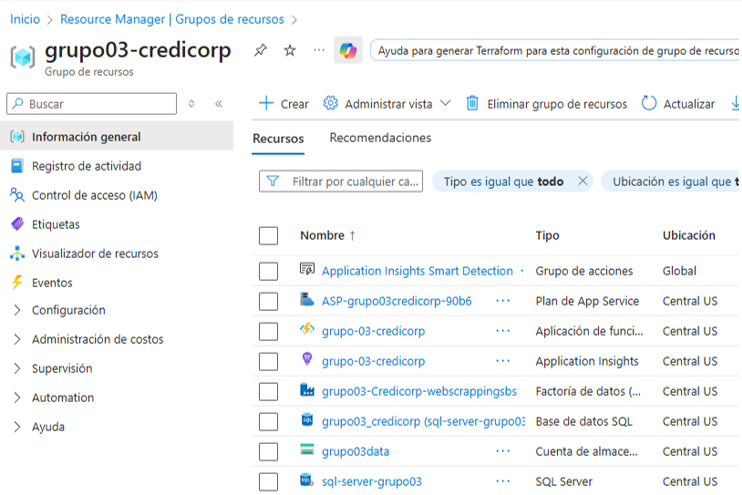

**Evidencia 1. Recursos del proyecto protegidos mediante IAM.**

---

### Flujo para asignar los roles

Azure Portal → Grupos de recursos → grupo03-credicorp → Control de acceso (IAM) → Agregar asignación de roles → Roles de función de trabajo → Elegir el rol según responsabilidad → Miembros → Seleccionar usuario → Revisar y asignar.

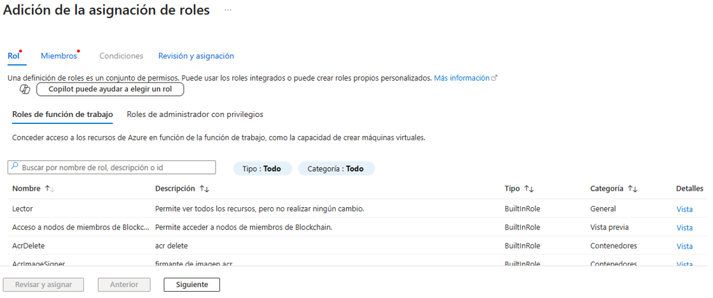

**Evidencia 2. Asignación de Roles**

---

### Resultado

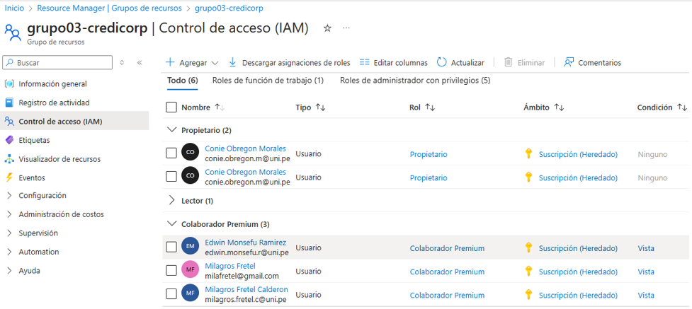

**Evidencia 3. Roles asignados al grupo**

El proyecto cumple con el enfoque Zero Trust, garantizando que cada usuario tenga acceso únicamente al alcance asignado y solo a los servicios específicos que debe operar. Esto reduce riesgos de modificaciones no autorizadas, asegura la continuidad operativa del ETL y fortalece el control de seguridad sobre todos los recursos desplegados en Azure.

---

## Rol Personalizado mediante Políticas JSON en Azure

Azure permite definir permisos de seguridad utilizando **roles personalizados configurados mediante documentos JSON**, lo cual mejora la gobernanza al controlar qué operaciones puede ejecutar cada usuario dentro del entorno cloud.

En el proyecto se creó un rol personalizado que permite únicamente la **lectura y supervisión** de la Function App, asegurando que un usuario no pueda modificar o eliminar componentes críticos del ETL.

### Para eso primero agregamos un rol personalizado

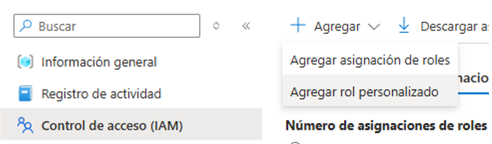

Se asignaron permisos como `"Microsoft.Web/sites/read"` y `"Microsoft.Web/sites/functions/read"`, evitando comandos de despliegue o eliminación accidental.

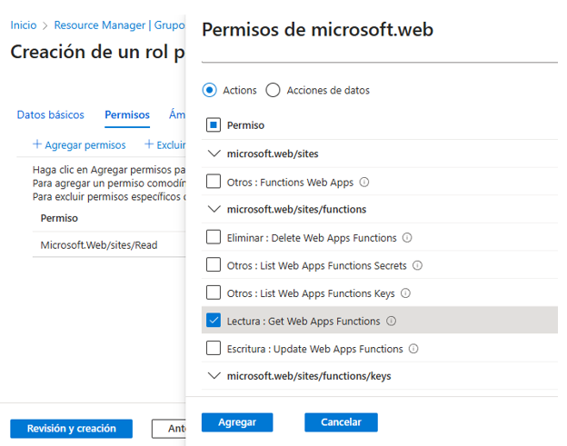

Luego personalizamos el rol mediante políticas JSON en Azure.

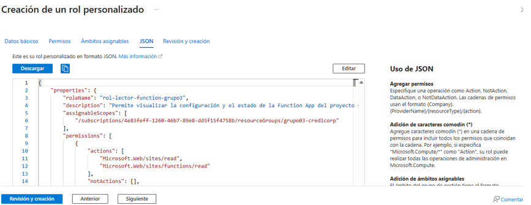

Y se obtiene la creación del rol personalizado:

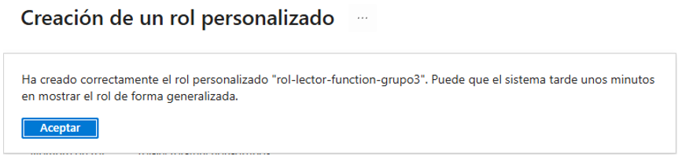

Finalmente se muestra el rol creado en la lista de roles:

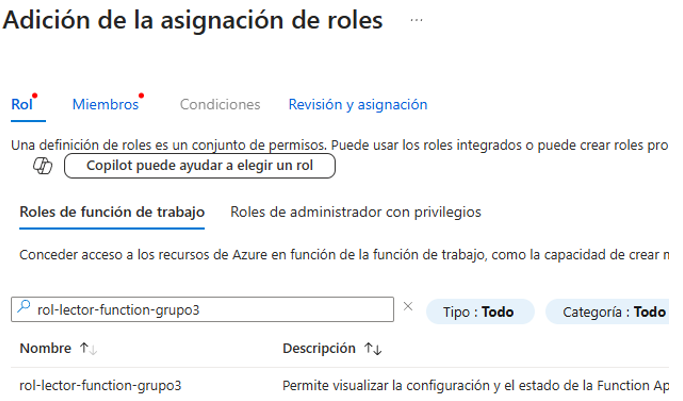

---

# Firewalls / Redes / Gobernanza de Red en Azure

En Azure, la seguridad de red se aplica mediante restricción del acceso público, controlando quién puede conectarse a servicios críticos como Storage Account, SQL Database y Function App.

---

## Protección en SQL Database

El servidor **sql-server-grupo03** aplica un firewall para proteger la base de datos utilizada como repositorio del flujo ETL.

Solo direcciones IP autorizadas pueden conectarse durante etapas de desarrollo.

**Configuración aplicada:**

- Acceso a la red pública: Redes seleccionadas → No se permite acceso abierto.

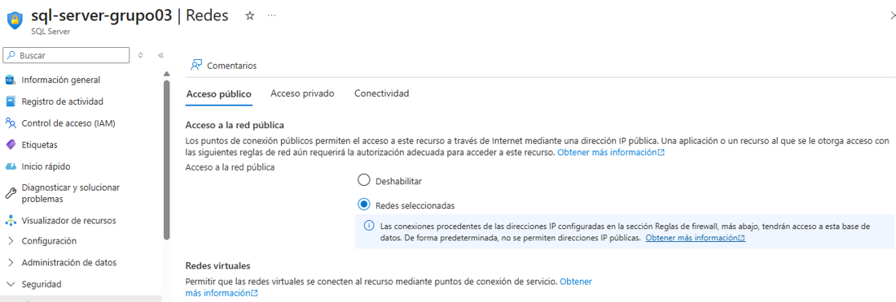

Solo direcciones IP específicas del equipo de desarrollo han sido habilitadas temporalmente:

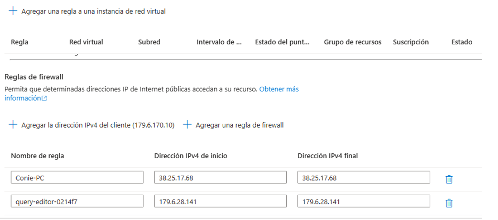

---

## Protección en Storage Account

El Storage Account `grupo03data` es un componente crítico del proyecto, ya que soporta almacenamiento y logs del proceso ETL.

**Políticas activas:**

- Acceso a la red pública deshabilitado  
- Sin direcciones IP externas autorizadas  
- Acceso permitido únicamente a servicios internos del proyecto  

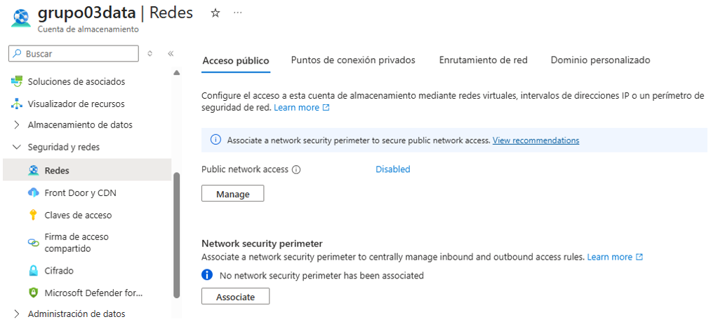

Configuración de redes e IP:

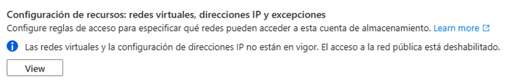

---

## Restricciones de acceso en Function App grupo-03-credicorp

La Function App procesará el flujo ETL en producción; por ello se implementó una política Zero-Trust bloqueando accesos.

**Configuración aplicada:**

- Acceso a la red pública requerido por el plan de consumo Linux (obligatorio por Azure)
- Sin embargo, el endpoint no es consumido por clientes externos
- La autenticación y comunicación interna se realiza con **Managed Identity**

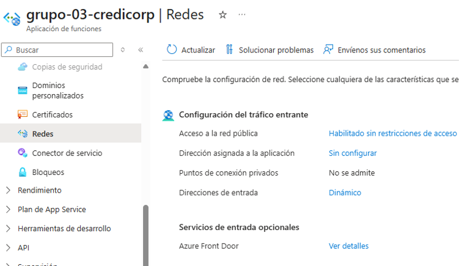

---

# Auditoría Activa en Azure (Activity Logs y Monitoreo del ETL)

Azure implementa auditoría permanente sobre los recursos del proyecto, garantizando trazabilidad y supervisión continua de acciones administrativas y operativas.

Esto permite identificar cambios no autorizados, detectar amenazas internas y asegurar cumplimiento en el ciclo de vida del flujo ETL.

## Mecanismos habilitados de auditoría

### Azure Activity Logs

Registra operaciones como:

- Asignación o eliminación de roles IAM  
- Cambios de configuración de red / firewall  
- Creación, actualización o eliminación de recursos  

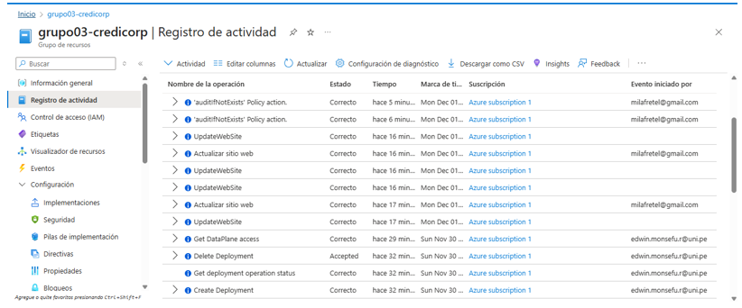

---

### Function App Monitoring (Application Insights)

Registra:

- Ejecución de funciones  
- Errores en tiempo real  
- Métricas del pipeline  

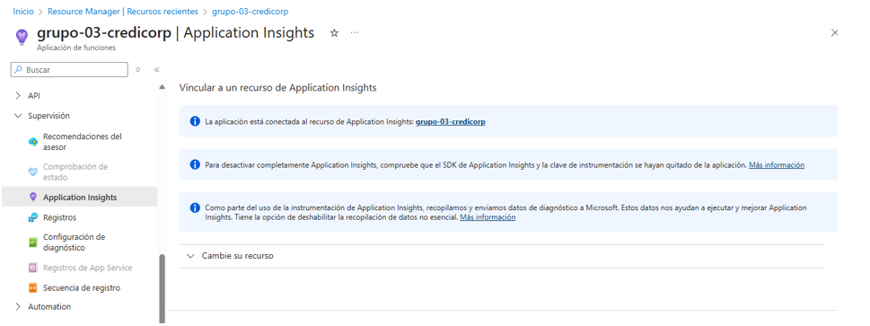

---

### Auditoría en SQL Database

Azure registra eventos críticos del motor SQL:

- Cambios en accesos y firewall  
- Configuración del servicio  
- Consultas administrativas y fallos de conexión  

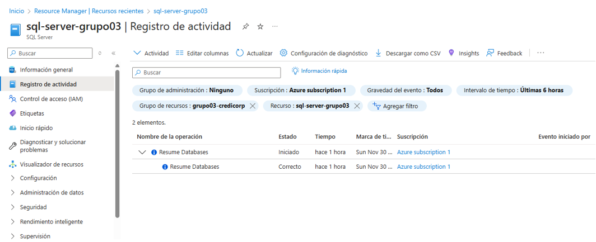

---

# Conectividad segura entre servicios en Azure (Private Access + Managed Identity)

En la arquitectura implementada, la comunicación entre los componentes del flujo ETL se realiza bajo un enfoque de **conectividad interna segura**, evitando exposición de endpoints públicos.

La comunicación Function App → SQL → Storage → Logging no usa credenciales ni accesos externos.

### Controles activados

| Mecanismo | Propósito | Impacto en Seguridad |
|----------|-----------|----------------------|
| Managed Identity | Autenticación automática entre servicios | El tráfico no depende de direcciones públicas |
| RBAC aplicado a identidades | Privilegios mínimos | Evita movimientos laterales |
| Accesos internos por API protegidos | Tráfico interno | Reduce ataques externos |

---
