# Examen Final – Desarrollo de Solución BI en la Nube

**Estudiante:** Fretel Calderon, Milagros Valeria  
**Curso:** SI807 – Cloud BI  
**Dataset:** Supermarket Sales (Kaggle)

## 1. Ingestión y Estructuración – BRONCE
### 1.1 Selección de la Nube
Para el desarrollo de esta solución de Business Intelligence se seleccionó **Microsoft Azure** como plataforma cloud.

La elección se justifica por las siguientes razones técnicas:

- Integración nativa con servicios de datos como Azure Data Lake Storage y Azure SQL.
- Soporte completo para cargas por línea de comandos (Azure CLI), requerido en el examen.
- Arquitectura escalable y orientada a análisis de datos.
- Experiencia previa de la autora en el uso de Azure durante las prácticas PC3 y PC4 del curso.

Azure permite implementar de forma clara las capas BRONCE, PLATA y ORO, asegurando trazabilidad, orden y reproducibilidad del proceso ETL.
### 1.2 Ingestión y Estructuración – BRONCE

Se implementó un Data Lake en **Azure Data Lake Storage Gen2 (HNS habilitado)**, creando el file system `datalake` y la estructura de carpetas:
- `bronce/raw`
- `bronce/processed`
- `bronce/curated`

Luego, el dataset **SuperMarket Analysis.csv** fue cargado a `bronce/raw` mediante **Azure CLI** usando autenticación por *account key*.  
La carga se validó listando el contenido del directorio `bronce/raw`, verificando el archivo y su tamaño.

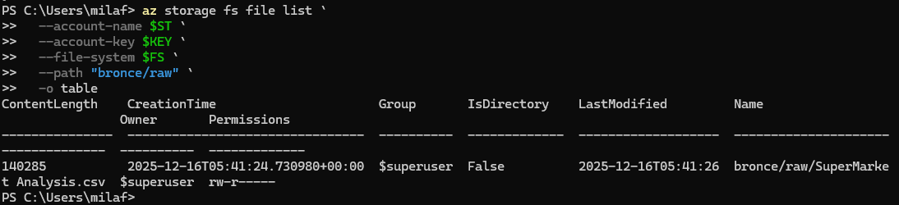

Nota: el Storage Account fuerza HTTPS y cifrado en reposo administrado por Azure, la validación de archivo se realizó por listado en ADLS Gen2.

### 1.3 EDA
Se realizó un análisis exploratorio inicial del dataset mediante un script en Python (`scripts/01_eda.py`), con el objetivo de:

- Verificar la estructura del dataset.
- Identificar valores nulos y tipos de datos.
- Obtener estadísticas descriptivas básicas.

Este análisis permitió validar la calidad del dataset antes de continuar con las etapas de transformación en las capas PLATA y ORO.

## 2. Modelo Estrella
**Tabla de Hechos:** fact_ventas  
**Dimensiones:** dim_tiempo, dim_sucursal, dim_producto, dim_cliente, dim_pago

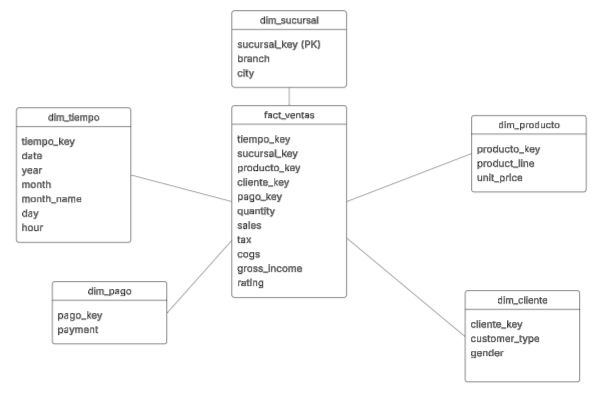

Justificación técnica para el modelo estrella:

En el caso de este proyecto de Business Intelligence, el modelo estrella se eligió por su capacidad de ofrecer un esquema sencillo y eficiente para representar los datos históricos de ventas de un supermercado.

Hecho central (fact_ventas):
El hecho central de este modelo es la tabla fact_ventas, que contiene todas las métricas clave sobre las ventas, tales como sales (ventas), quantity (cantidad), tax (impuesto), cogs (costo de bienes vendidos), gross_income (ingreso bruto) y rating (calificación). Esta tabla será el centro del modelo y se conecta con varias tablas de dimensión para describir las diferentes características de las ventas.

Tablas de dimensión:
Se han creado cuatro tablas de dimensión para proporcionar detalles sobre las métricas:

-dim_tiempo: Describe las características temporales de la venta, como la fecha, mes, año, etc.
-dim_sucursal: Describe las características de la sucursal donde se realizó la venta, como la ciudad y la sucursal en sí.
-dim_producto: Contiene la información sobre los productos, como el tipo de producto y el precio unitario.
-dim_cliente: Contiene datos del cliente, como el tipo de cliente y género.
-dim_pago: Contiene información sobre el método de pago de la venta.

### 2.1 Evidencia de ETL Y LOGS
El proceso de ETL (Extract, Transform, Load) se realizó en las tres capas mencionadas: BRONCE, PLATA y ORO, usando **Azure CLI** para la carga y procesamiento de datos. Se realizaron validaciones en cada paso mediante logs generados automáticamente.

- **Bruto (BRONCE)**: Carga del dataset `SuperMarket Analysis.csv` en el Data Lake.
  - **Evidencia CLI**: `docs/evidencias_cli/02_upload_y_listado_bronce_raw.png`

Se construyó un modelo estrella con una tabla de hechos central (`fact_ventas`) y cinco tablas de dimensión (`dim_tiempo`, `dim_sucursal`, `dim_producto`, `dim_cliente`, `dim_pago`).

El modelo se implementó mediante el script `scripts/03_plata_modelo.py`, el cual:
- Lee el dataset desde la capa BRONCE.
- Genera claves sustitutas para cada dimensión.
- Construye la tabla de hechos con métricas de ventas.
- Guarda los resultados en la carpeta `plata/`.

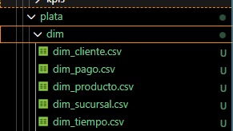

- **Oro (KPIs)**: Generación de KPIs como ventas por sucursal, margen, top productos, etc.
  - **Evidencia de KPIs**: `docs/evidencias_cli/04_kpis_generados.png`

Esto asegura la trazabilidad completa de las transformaciones de datos desde la carga inicial hasta la obtención de KPIs.

## 3. KPIs
Milagros\scripts> python 04_oro_kpis.py
C:\Users\milaf\anaconda3\Lib\site-packages\pandas\core\arrays\masked.py:60: UserWarning: Pandas requires version '1.3.6' or newer of 'bottleneck' (version '1.3.5' currently installed).
  from pandas.core import (
KPIs generados correctamente (ORO). Archivos en oro/kpis/
PS C:\INEActual\SI807_Cloud_BI_2025\grupo03_credicorp\ExFinal\SolucionIndividual\Fretel_Calderon_Milagros\scripts>
Se han generado los siguientes KPIs para el análisis:

- **Ventas por Sucursal**: Muestra la venta total por cada sucursal.
- **Margen de Ganancia**: Calculado como `gross_income / sales`.
- **Top Productos**: Los productos con más ventas.
- **Ticket Promedio**: Promedio de ventas por cliente.
- **Ventas por Forma de Pago**: Muestra las ventas desglosadas por método de pago.

**Evidencia Visual de KPIs:**

Estos KPIs permiten analizar el desempeño de ventas a nivel de sucursal, producto, y tipo de cliente.

## 4. Visualización
Se desarrollaron dashboards en Power BI para el análisis interactivo de los KPIs definidos.

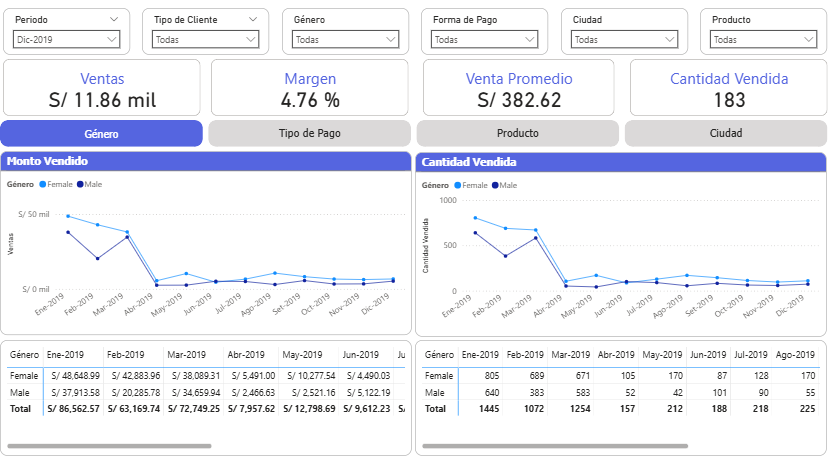
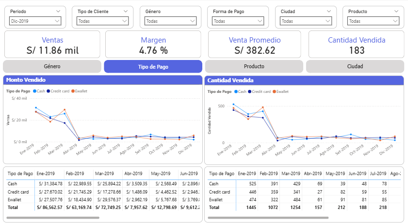
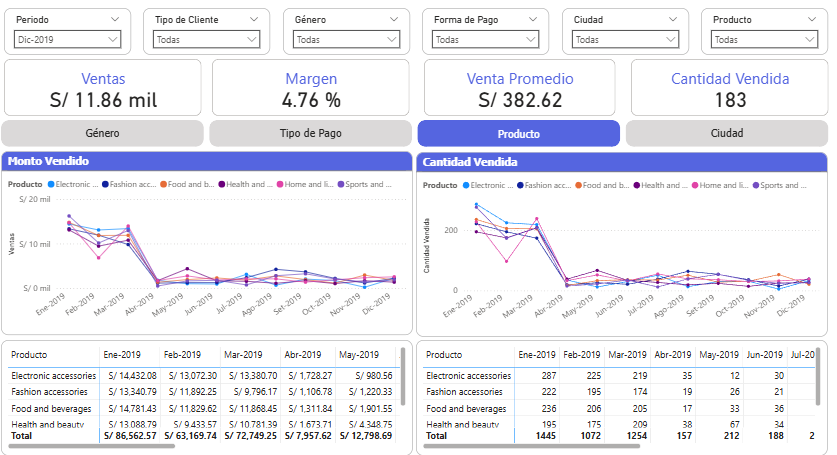
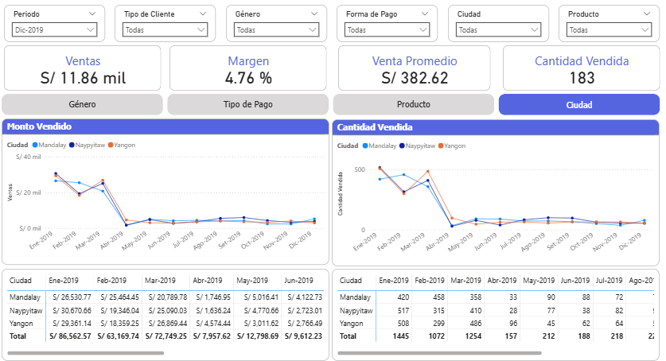
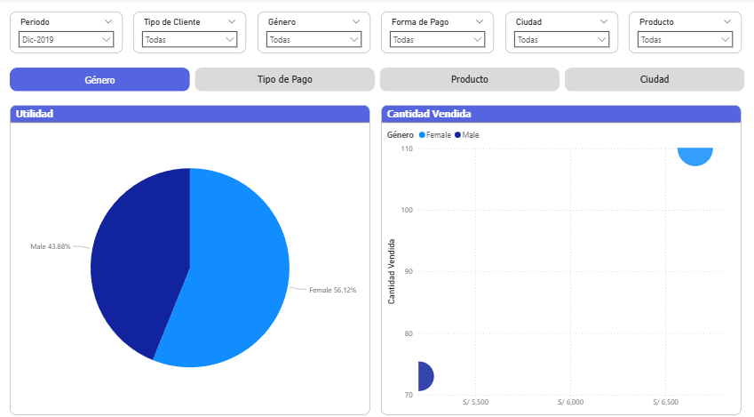
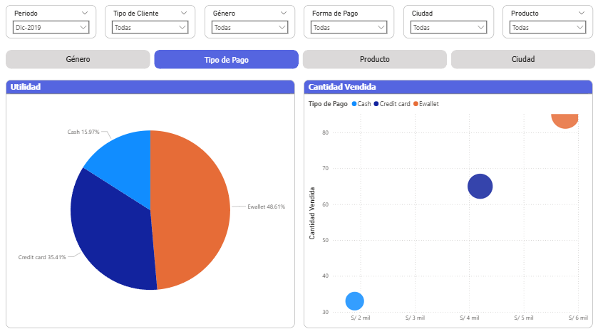
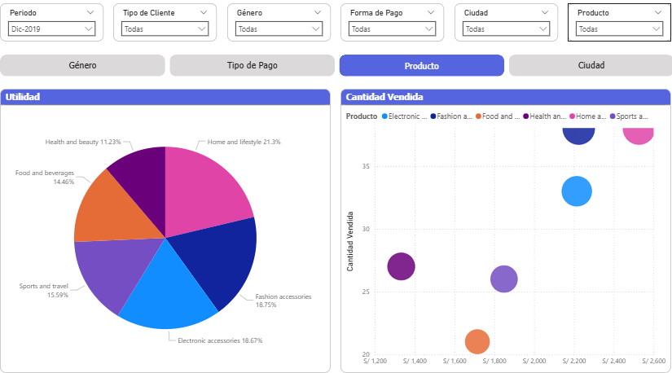
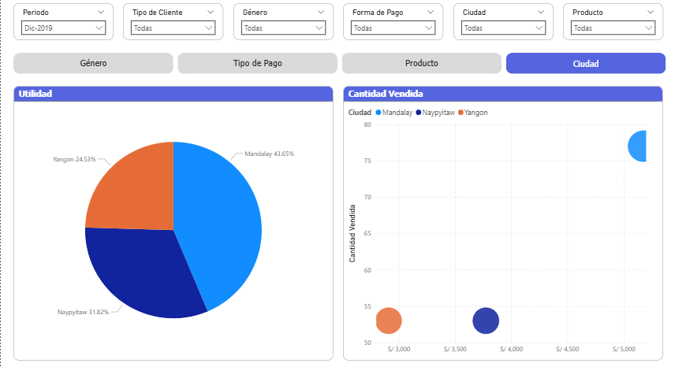

## 5. Evidencias
Las evidencias de ejecución, logs y visualizaciones se encuentran en la carpeta `docs/`.
