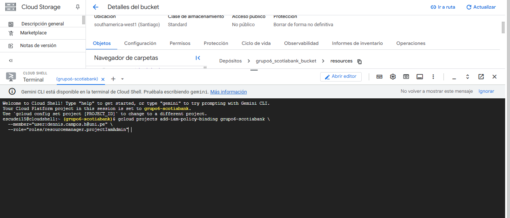
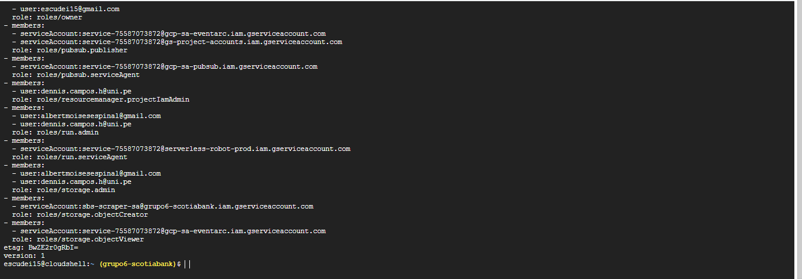
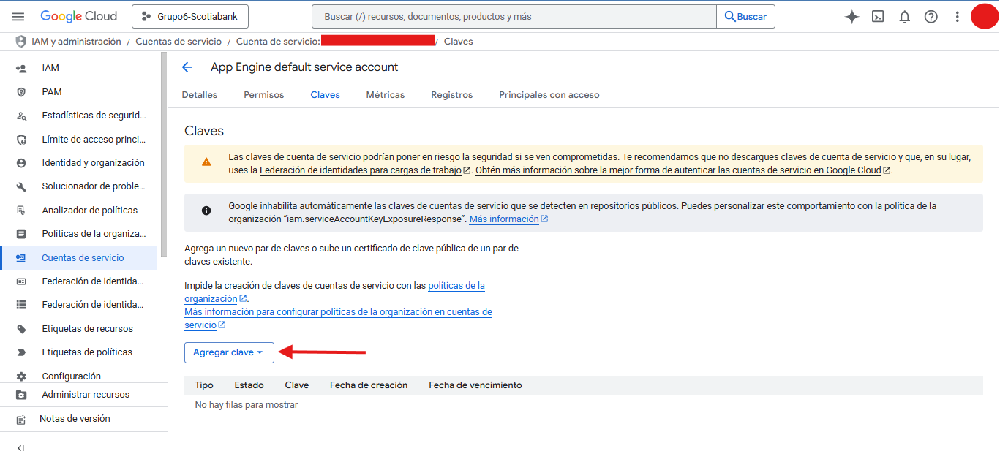
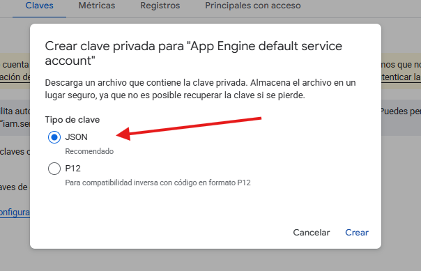
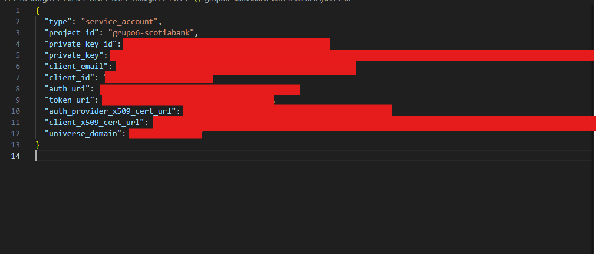

# 1. Creación del Proyecto

Se creó un proyecto independiente en Google Cloud Platform para aislar todos los recursos de la práctica, evitando contaminaciones con otros proyectos personales o institucionales.

## 🛂 2. Gestión de Identidades y Accesos (IAM)

Se aplicó el principio de mínimo privilegio, asignando permisos únicamente según las funciones técnicas del flujo de datos. Cada rol fue otorgado vía CLI usando gcloud, garantizando trazabilidad.



### ✔️ Roles técnicos generales del proyecto

```json
gcloud projects add-iam-policy-binding grupo6-scotiabank \
  --member="serviceAccount:sbs-scraper-sa@grupo6-scotiabank.iam.gserviceaccount.com" \
  --role="roles/storage.objectCreator"

gcloud projects add-iam-policy-binding grupo6-scotiabank \
  --member="serviceAccount:75587073872-compute@developer.gserviceaccount.com" \
  --role="roles/artifactregistry.reader"

gcloud projects add-iam-policy-binding grupo6-scotiabank \
  --member="serviceAccount:service-75587073872@gcp-sa-eventarc.iam.gserviceaccount.com" \
  --role="roles/storage.objectViewer"

``` 
Servicio / Cuenta	Función

- storage.objectCreator:Permite carga de archivos desde scraping hacia el Data Lake

- artifactregistry.reader: Acceso a imágenes necesarias para servicios compute
storage.objectViewer	Permite lectura de objetos para flujos event-driven
## 👥 3. Roles asignados según función en el pipeline

Asignar roles a los usuarios a travez de la linea de comandos CLI de Google Cloud Plataform

- **Cambiar en Usuario1** : PONER@USUARIO1 -> por el usuario 1 admitido
- **Cambiar en Usuario2** : PONER@USUARIO2 -> por el usuario 2 admitido

### 🔸 Rol 1 – Scraping y carga de datos al Data Lake

Responsabilidades:

- Obtención de archivos Excel desde la web del SBS

- Ejecución periódica del scraping

- Carga automatizada de los archivos raw a Cloud Storage

**Permisos otorgados para su actividad:**


```bash
gcloud projects add-iam-policy-binding grupo6-scotiabank --member="user:PONER@USUARIO1" --role="roles/cloudfunctions.developer" && \
gcloud projects add-iam-policy-binding grupo6-scotiabank --member="user:PONER@USUARIO1" --role="roles/storage.admin" && \
gcloud projects add-iam-policy-binding grupo6-scotiabank --member="user:PONER@USUARIO1" --role="roles/cloudscheduler.admin" && \
gcloud projects add-iam-policy-binding grupo6-scotiabank --member="user:PONER@USUARIO1" --role="roles/iam.serviceAccountUser" && \
gcloud projects add-iam-policy-binding grupo6-scotiabank --member="user:PONER@USUARIO1" --role="roles/run.admin" && \
gcloud projects add-iam-policy-binding grupo6-scotiabank --member="user:PONER@USUARIO1" --role="roles/resourcemanager.projectIamAdmin"
```

➡️ Con este set, el rol puede programar, ejecutar y operar funciones serverless encargadas de capturar los datos fuente y almacenarlos en la capa bronze del Data Lake.


### 🔸 Rol 2 – Procesamiento, ETL y modelado analítico

Responsabilidades:

- Transformación de datos con ETL

- Uso de BigQuery como repositorio analítico

- Creación y administración de datasets

- Diseño de capas Bronze, Silver (Plata) y Gold (Oro)


**Permisos otorgados:**
```bash
gcloud projects add-iam-policy-binding grupo6-scotiabank --member=user:PONER@USUARIO2 --role="roles/bigquery.dataOwner" && \
gcloud projects add-iam-policy-binding grupo6-scotiabank --member=user:PONER@USUARIO2 --role="roles/cloudfunctions.developer" && \
gcloud projects add-iam-policy-binding grupo6-scotiabank --member=user:PONER@USUARIO2 --role="roles/storage.admin" && \
gcloud projects add-iam-policy-binding grupo6-scotiabank --member=user:PONER@USUARIO2 --role="roles/cloudscheduler.admin" && \
gcloud projects add-iam-policy-binding grupo6-scotiabank --member=user:PONER@USUARIO2 --role="roles/run.admin"
```

➡️ Este rol gobierna la evolución de los datos, pasando de sin procesar → curados → listos para explotación analítica.




### 🔸 Cuenta de Servicio - Clave

Se creo una clave para la cuenta de servicio con el cual permitira la explotación analítica.





Esto descargará y generará un archivo JSON con credenciales y claves que permitiran la coneccion con fuentes externar analíticas como el PowerBI



📘 Puede comprobar la conexión en [08_PowerBI](../08_PowerBI/README.md)


## 🔐 4. Principios de Seguridad aplicados

Se implementaron prácticas recomendadas:

- ✔ IAM granular por función técnica
- ✔ Ningún usuario con rol Owner
- ✔ Acceso a Storage y BigQuery controlado por capas
- ✔ Service Accounts independientes para automatizaciones
- ✔ Uso de CLI → mayor auditabilidad del despliegue


# Escalabilidad, Elasticidad y Alta Disponibilidad

## 1. ANÁLISIS DE NECESIDADES DEL PROYECTO

### Características Actuales
- **Volumen de datos:** Archivos de MB, procesamiento mensual
- **Datos procesados:** ~400k registros (Bronze) → ~4k registros (Gold)
- **Usuarios concurrentes:** Máximo 5 usuarios en Power BI
- **Frecuencia de carga:** Mensual (SBS publica datos mensualmente)
- **Tiempo de procesamiento:** <10 minutos por job de Spark
- **Criticidad:** Dashboard de riesgo bancario (alta importancia, baja frecuencia)

### Evaluación de Requerimientos

| Componente | Escalabilidad | Elasticidad | Alta Disponibilidad | Justificación |
|------------|---------------|-------------|---------------------|---------------|
| Cloud Storage | ✅ Nativa | ✅ Serverless | ⚠️ Implementar | Datos críticos requieren redundancia |
| Cloud Functions | ✅ Nativa | ✅ Serverless | ✅ Multi-zona automática | Ya incluida por diseño |
| Dataproc | ⚠️ Configurar | ⚠️ Configurar | ❌ No necesario | Jobs efímeros de 10 min no requieren HA |
| BigQuery | ✅ Nativa | ✅ Serverless | ⚠️ Implementar | Datos históricos requieren DR |
| Power BI | N/A | N/A | N/A | Gestionado externamente |

---

## 2. ESCALABILIDAD

### 2.1 Cloud Storage (Descarga SBS)
**Estado:** ✅ **ESCALABLE POR DISEÑO - NO REQUIERE CONFIGURACIÓN ADICIONAL**

**Justificación:**
- Cloud Storage escala automáticamente de bytes a petabytes
- En el caso: Archivos de MB mensuales están muy por debajo de límites
- No hay configuración de escalabilidad necesaria

**Cuándo SÍ sería necesario configurar:**
- Archivos >5TB que requieran particionamiento
- Ingesta de miles de archivos por segundo
- Transferencias desde múltiples regiones

### 2.2 Dataproc (Procesamiento Spark)
**Estado:** ⚠️ **CONFIGURAR AUTOSCALING HORIZONTAL**

**Justificación:**
- Aunque el job dura <10 min, el autoscaling optimiza costos
- Permite manejar picos si el volumen de datos crece
- Escala de 2 a N workers según necesidad

**Configuración recomendada:**
- Cluster efímero con 1 master + 2-8 workers
- Autoscaling basado en métricas de YARN
- Preemptible workers para reducir costos 60%

### 2.3 BigQuery
**Estado:** ✅ **ESCALABLE POR DISEÑO - SERVERLESS**

**Justificación:**
- BigQuery escala automáticamente desde KB hasta petabytes
- En el caso: 400k registros en Bronze, 4k en Gold es minimal
- Slots on-demand escalan según la consulta
- Power BI con 5 usuarios no generará carga significativa

**Cuándo SÍ necesitarías escalabilidad vertical:**
- Consultas complejas con >1TB de datos escaneados
- >100 usuarios concurrentes
- Jobs de ML intensivos en BigQuery ML

---

## 3. ELASTICIDAD (AUTOSCALING)

### 3.1 Cloud Functions (Descarga automatizada)
**Estado:** ✅ **ELÁSTICA POR DISEÑO - SERVERLESS**

**Justificación:**
- Cloud Functions escala de 0 a miles de instancias automáticamente
- En el caso: 1 ejecución mensual = 1 instancia
- Pago por uso (solo cuando se ejecuta)
- Sin configuración adicional necesaria

### 3.2 Dataproc Autoscaling
**Estado:** ⚠️ **IMPLEMENTAR AUTOSCALING**

**Justificación PARA implementar:**
- Jobs efímeros se benefician de autoscaling para optimizar tiempo/costo
- Si un mes los datos de SBS crecen 10x, el cluster se adapta
- Destrucción automática después del job (ahorro de costos)

**Configuración:**
- Min workers: 2
- Max workers: 8
- Scale-down factor: Agresivo (job corto)
- Preemptible workers: 50% del cluster

### 3.3 BigQuery
**Estado:** ✅ **ELÁSTICO POR DISEÑO**

**Justificación:**
- Slots on-demand se asignan dinámicamente
- Escala a 0 cuando no hay consultas
- En el caso: 5 usuarios = ~100-500 slots máximo
- Sin configuración necesaria

**Cuándo SÍ configurarías reservations:**
- >50 usuarios concurrentes
- Consultas predecibles que requieren SLA garantizado
- Necesidad de control de costos con flat-rate pricing

---

## 4. ALTA DISPONIBILIDAD Y DISASTER RECOVERY

### 4.1 Cloud Storage
**Estado:** ⚠️ **IMPLEMENTAR DUAL-REGIONAL**

**Justificación PARA implementar:**
- Datos de SBS son fuente única de verdad
- Si se pierde el bucket, no hay forma de recuperar datos históricos
- Cumplimiento regulatorio bancario requiere DR

**Configuración:**
- Storage Class: `STANDARD` dual-regional
- Regiones: `southamerica-east1` + `us-east1` (o `southamerica-west1` cuando esté disponible)
- Versionamiento: Habilitado (recuperar archivos sobrescritos)
- Lifecycle: Mover a Nearline después de 90 días

### 4.2 Cloud Functions
**Estado:** ✅ **ALTA DISPONIBILIDAD NATIVA**

**Justificación:**
- Cloud Functions 2nd gen se despliega automáticamente en múltiples zonas
- Si una zona falla, Cloud Run ejecuta en otra zona
- Para job mensual, la disponibilidad nativa es suficiente

**Cuándo SÍ configurarías multi-región:**
- Funciones críticas de tiempo real (no tu caso)
- APIs públicas con SLA >99.95%

### 4.3 Dataproc
**Estado:** ❌ **NO IMPLEMENTAR HA**

**Justificación PARA NO implementar:**
- Clusters efímeros de 10 minutos no requieren HA
- Si falla un job, simplemente se re-ejecuta
- El costo de HA mode (3 masters) no se justifica
- Los datos origen (GCS) y destino (BQ) SÍ tienen HA

**Cuándo SÍ implementarías HA mode:**
- Clusters permanentes 24/7
- Jobs críticos de >2 horas
- HDFS con datos que no están en GCS

### 4.4 BigQuery
**Estado:** ⚠️ **IMPLEMENTAR BACKUP MULTI-REGIONAL**

**Justificación PARA implementar:**
- Datos históricos de riesgo bancario son críticos
- Regulación financiera requiere DR (RPO/RTO bajos)
- BigQuery datasets NO se replican automáticamente

**Configuración:**
- Dataset principal: `southamerica-east1`
- Backup dataset: `us-east1` o `EU` (multi-regional)
- Snapshots automáticos después de cada carga mensual
- Retention: 12 meses mínimo

**RPO/RTO esperados:**
- RPO (Recovery Point Objective): 1 mes (última carga)
- RTO (Recovery Time Objective): <4 horas (restaurar desde snapshot)

---

## 5. RESUMEN DE IMPLEMENTACIONES

### ✅ Implementar (Justificado)
1. **Cloud Storage Dual-Regional:** Protección de datos fuente
2. **Dataproc Autoscaling:** Optimización costo/performance
3. **BigQuery Backup Multi-Regional:** DR para datos históricos
4. **Versionamiento en GCS:** Recuperación de archivos

### ❌ NO Implementar (Justificado)
1. **Dataproc HA Mode:** Jobs efímeros no lo requieren
2. **BigQuery Reservations:** Volumen bajo, on-demand suficiente
3. **Cloud Functions Multi-Región:** Job mensual, HA nativa suficiente

### ⚠️ Casos Hipotéticos (Documentar cuándo SÍ aplicarían)
1. **Escalabilidad vertical BigQuery:** Si crece a >10M registros/día
2. **Multi-región activo-activo:** Si Power BI se usa globalmente 24/7
3. **Dataproc clusters permanentes:** Si se requieren consultas interactivas

---

## 6. ARQUITECTURA RECOMENDADA

```
┌─────────────────────────────────────────────────────────────────┐
│  REGIÓN: southamerica-east1 (São Paulo) - PRINCIPAL             │
├─────────────────────────────────────────────────────────────────┤
│                                                                 │
│  Cloud Storage (Dual-Regional)                                  │
│  ├── sbs-raw-data/ (Bronze source)                             │
│  │   ├── Class: STANDARD (dual-region)                         │
│  │   ├── Versioning: ON                                        │
│  │   └── Lifecycle: → Nearline (90d)                           │
│  │                                                              │
│  Cloud Functions (Multi-AZ automático)                          │
│  ├── download-sbs-monthly                                      │
│  └── trigger-dataproc-job                                      │
│                                                                 │
│  Dataproc (Ephemeral + Autoscaling)                            │
│  ├── Master: n1-standard-4 (1)                                 │
│  ├── Workers: n1-standard-4 (2-8 autoscaling)                  │
│  ├── Preemptible: 50% workers                                  │
│  └── Auto-delete: 30min after idle                             │
│                                                                 │
│  BigQuery (Serverless)                                          │
│  ├── Dataset: bronze_sbs (regional)                            │
│  ├── Dataset: silver_sbs (regional)                            │
│  └── Dataset: gold_sbs (regional)                              │
│                                                                 │
└─────────────────────────────────────────────────────────────────┘

┌─────────────────────────────────────────────────────────────────┐
│  REGIÓN: us-east1 (Carolina del Sur) - DR                       │
├─────────────────────────────────────────────────────────────────┤
│                                                                 │
│  Cloud Storage (Replica dual-regional automática)               │
│                                                                 │
│  BigQuery Snapshots (Backup mensual)                            │
│  ├── Dataset: bronze_sbs_backup                                │
│  ├── Dataset: silver_sbs_backup                                │
│  └── Dataset: gold_sbs_backup                                  │
│                                                                 │
└─────────────────────────────────────────────────────────────────┘

┌─────────────────────────────────────────────────────────────────┐
│  EXTERNO: Power BI (conecta via BigQuery connector)             │
│  └── Consulta: gold_sbs.kpis_riesgo (pre-agregado)             │
└─────────────────────────────────────────────────────────────────┘
```

---

## 7. ESTIMACIÓN DE COSTOS (Mensual)

| Componente | Configuración | Costo Estimado USD |
|------------|---------------|-------------------|
| Cloud Storage Dual-Regional | 1 GB datos | $0.05 |
| Cloud Functions | 1 ejecución/mes | <$0.01 |
| Dataproc Autoscaling | 10 min/mes, 4 workers avg | $0.30 |
| BigQuery Storage | 1 GB | $0.02 |
| BigQuery Queries | 5 usuarios, 100 MB/día | $0.25 |
| BigQuery Snapshots | 1 GB backup | $0.03 |
| **TOTAL** | | **~$0.65/mes** |


---

## 8. PLAN DE IMPLEMENTACIÓN

### Fase 1: Escalabilidad y Elasticidad (Semana 1)
- [ ] Configurar Dataproc autoscaling
- [ ] Validar autoscaling con job de prueba
- [ ] Documentar métricas de escalado

### Fase 2: Alta Disponibilidad (Semana 2)
- [ ] Migrar Cloud Storage a dual-regional
- [ ] Habilitar versionamiento en buckets
- [ ] Configurar lifecycle policies

### Fase 3: Disaster Recovery (Semana 3)
- [ ] Crear datasets de backup en us-east1
- [ ] Automatizar snapshots de BigQuery
- [ ] Documentar procedimiento de restauración
- [ ] Ejecutar simulacro de DR

### Fase 4: Monitoreo (Semana 4)
- [ ] Configurar Cloud Monitoring dashboards
- [ ] Alertas para fallos en Cloud Functions
- [ ] Alertas para costos >$10/mes
- [ ] Documentar runbook de incidentes