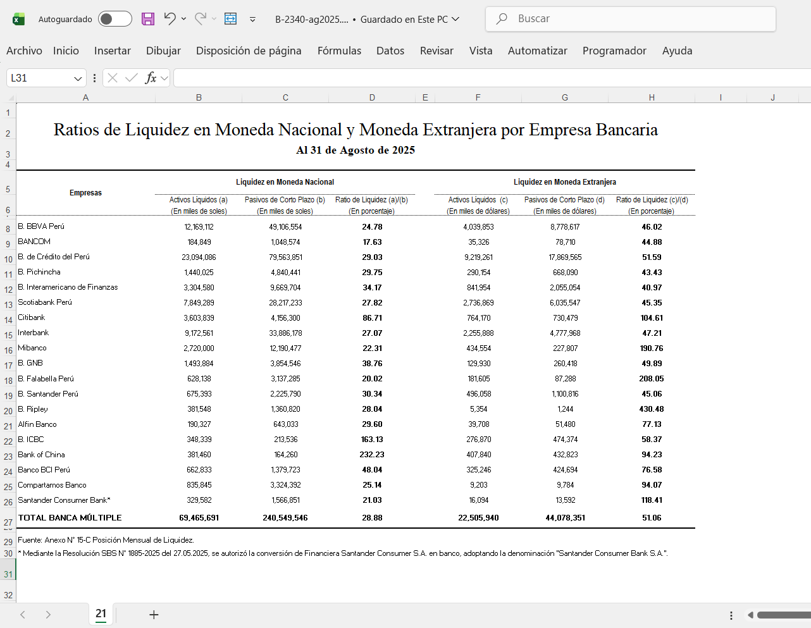

# 📁 **Extracción, Transformación y Carga (Bronce)**

Aquí se explica los pipelines responsables de la **ingesta, limpieza y estandarización inicial** de los datos provenientes de fuentes externas (SBS, BCRP). Representa la **capa Bronce** dentro de la arquitectura Medallion.

Los ETL se ejecutan a través de una **Cloud Function (bronce-dispatcher)** que detecta automáticamente nuevos archivos subidos al bucket de Google Cloud Storage.

---

## 📌 **Recordatorio: Código Fuente de la Cloud Function**

El código completo de la Cloud Function se encuentra en la carpeta:

👉 **`/resources/bronce-dispatcher/`** ([Ver carpeta en GitHub](../resources)) 

### Estructura interna de la Cloud Function:

```
resources/
└── bronce-dispatcher
    ├── config
    │   ├── __init__.py
    │   └── paths.py
    ├── pipelines                (ETL) <- AQUÍ ESTAMOS
    │   ├── bcrp
    │   │   ├── __init__.py
    │   │   └── tipo_cambio.py
    │   └── sbs
    │       ├── __init__.py
    │       ├── creditos.py
    │       ├── depositos.py
    │       ├── patrimonio.py
    │       └── ratio_liquidez.py
    ├── utils
    │   ├── __init__.py
    │   ├── bigquery.py
    │   └── gcs.py
    ├── main.py
    ├── requirements.txt
```

🎯 **Ahora nos encontramos explicando el Pipeline de ETL**

---

## ✅ **Flujo General del ETL**

### **1️⃣ Ingesta del archivo en el Data Lake (Raw)**

Los archivos se suben a:

```
gs://grupo6_scotiabank_bucket/data/raw/<FUENTE>/<ENTIDAD>/
```

Ejemplos:

* `data/raw/SBS/RATIO_LIQUIDEZ/`
* `data/raw/SBS/DEPOSITOS/`
* `data/raw/BCRP/TIPO_CAMBIO/`

Cada subida genera un evento GCS → Cloud Function.


---

### **2️⃣ Dispatcher de Cloud Function**

La función `bronce-dispatcher` identifica qué pipeline ejecutar según el prefijo del archivo.

Ejemplo:

```python
if name.startswith(paths.PREFIX_RATIO_LIQUIDEZ):
    run_pipeline_ratio_liquidez(bucket, name)
```

---

### **3️⃣ Transformación**

Cada pipeline:

✔ Lee Excel/CSV desde GCS (Extraction)
✔ Limpia y normaliza **(Transformation)**  
✔ Estandariza columnas **(Transformation)**  
✔ Convierte a formato tabular uniforme **(Transformation)**  
✔ Añade campos de auditoría **(Transformation)**   
✔ Inserta en BigQuery (Bronce) (Load)

---

#### 🧩 **Ejemplo Detallado: Pipeline ETL - Ratio de Liquidez**




##### 🔍 **Lectura del archivo**

```python
df_raw = leer_excel_desde_gcs(bucket_name, file_name, "21")
```

Lee una hoja específica (“21”) del Excel SBS.

---

##### 🗂 **Extracción de metadatos desde el nombre del archivo**

Se obtiene **mes y año** automáticamente:

```python
parts = file_name.replace(".xlsx", "").split("-")
mes = raw_date[:2]
anio = int(raw_date[-4:])
```

---

##### 🔧 **Procesamiento de bloques MN y ME**

El Excel contiene:

* Bloque en **Moneda Nacional (MN)**
* Bloque en **Moneda Extranjera (ME)**

Se separan y combinan:

```python
df_total = pd.concat([mn, me], ignore_index=True)
```

---

##### 🧹 **Limpieza de datos**

* Remoción de comas
* Remoción de signos de porcentaje
* Trimming

```python
df_total[col] = df_total[col].str.replace(",", "").str.replace("%", "")
```

---

##### 🏷 **Columnas de auditoría**

```python
df_total["anio"] = anio
df_total["mes"] = mes
df_total["fecha_carga"] = datetime.utcnow()
```

---

## **4️⃣ Load: Carga a BigQuery - Capa Bronce**

```python
cargar_dataframe_bigquery(df_transformado, DATASET_BRONCE, TABLE_RATIO)
```

El dataset utilizado es:

```
bronce.sbs_liquidez
```

---

## **5️⃣ Lanzamiento Automático del Job Dataproc (Plata → Oro)**

Después de cargar a Bronce, se lanza un job PySpark:

```python
ejecutar_dataproc_ratio_liquidez()
```

Este job:

✔ Lee `bronce.*`
✔ Genera tablas **plata.sbs_*
✔ Construye tablas oro (`hecho_riesgo`, dimensiones, cálculos)

Esto se explique a detalle en ([05_Procesamiento_Spark](../05_Procesamiento_Spark/README.md)) 

---

# 🎥 **Explicación del proceso**

Si quieres ver el proceso detallado, puedes ver el siguiente video:

[](https://youtu.be/jdcOAb0z28s)