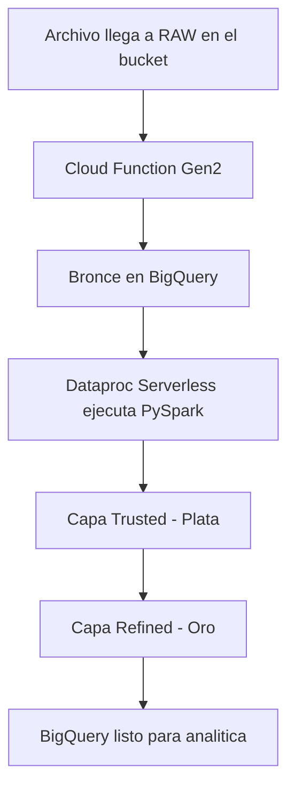

# 📁 **DataLake - Arquitectura Medallion en GCS**

Aquí se explica los la organización del **Data Lake en Google Cloud Storage (GCS)**, donde se almacena y transforma la información financiera del pipeline.

El Data Lake sigue el modelo **Medallion Architecture**:

```
04_DataLake/
    ├── raw/        # Bronce
    ├── trusted/    # Plata
    └── refined/    # Oro
```


# 🟫 **1. Capa Raw (y Bronce)**

📌 Ubicación en GCS:

```
gs://grupo6_scotiabank_bucket/raw/
```

Aquí se almacenan **los archivos originales** provenientes de SBS y BCRP.
No se modifican, sirven como fuente de verdad y activan automáticamente la Cloud Function:

```
grupo6_scotiabank_bucket/data/raw/
    ├── sbs/RATIO_LIQUIDEZ/B-2340-ab2024.xls
    ├── sbs/CREDITOS_SEGUN_SITUACION/B-2315-ab2000.xls
    └── bcrp/TIPO_CAMBIO/tipo_cambio_2024_01.xlsx
```

**Cada archivo que llega a esta capa activa automáticamente**
la Cloud Function `bronce-dispatcher`, iniciando el proceso ETL.


> 🛈 La *Capa Bronce* también existe en BigQuery:
>  
> - **Raw (GCS)** almacena los archivos originales sin tocar.  
> - **Bronce (BigQuery)** almacena esos mismos datos pero **tabulados y mínimamente normalizados** para que Spark pueda procesarlos en Plata y Oro.


---

# 🥈 **2. Capa Trusted (Plata)**

Contiene datos:

* Limpios
* Estandarizados
* Convertidos a CSV/Parquet

Estos archivos son generados automáticamente por los jobs PySpark de Dataproc.
Representan las mismas estructuras que las tablas BigQuery en el dataset **`plata`**.

---

# 🥇 **3. Capa Refined (Oro)**

Contiene:

* Tablas de hechos
* Dimensiones
* Datos enriquecidos listos para analítica

Estas salidas coinciden con las tablas del dataset BigQuery **`oro`**
y son generadas por Dataproc Serverless.

---

# ⚙️ **Flujo Automático del Data Lake**


