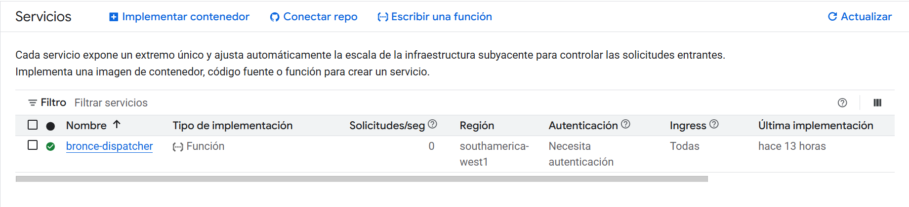
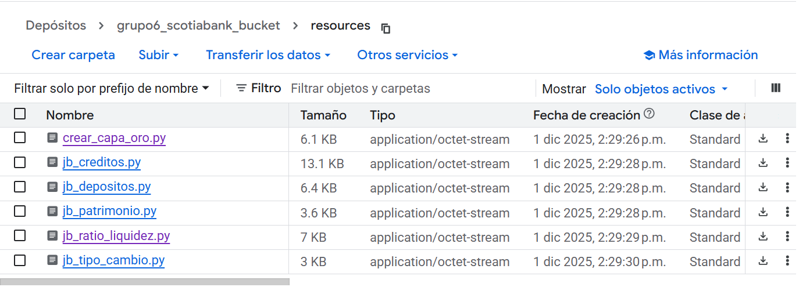
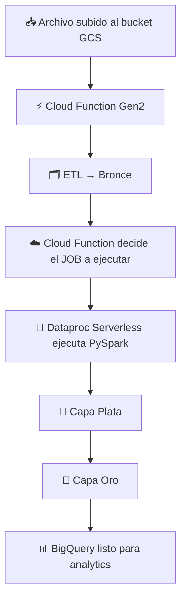
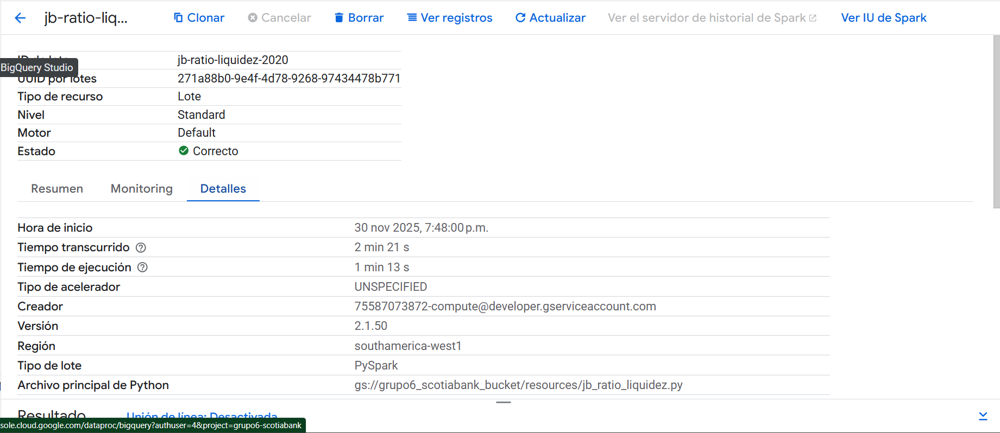

# 📁 **Procesamiento_Spark - Capa Plata y Capa Oro (Dataproc)**

Aqui se explica los scripts PySpark encargados de procesar los datos desde la **capa Bronce (BigQuery)** hacia:

* **Capa Plata** → Datos limpios, estandarizados, consolidados
* **Capa Oro** → Tablas de hechos y dimensiones para análisis avanzado

Los procesos de esta carpeta se ejecutan automáticamente después de los pipelines de ETL, mediante **Dataproc Serverless**.

---

### 📌 **Recuerda: los scripts PySpark se encuentran en la carpeta**

👉 **`/resources/jobs/`** ([Ver carpeta en GitHub](../resources/))

```
resources/
└── jobs/
    ├── crear_capa_oro.py
    ├── jb_creditos.py
    ├── jb_depositos.py
    ├── jb_patrimonio.py
    ├── jb_ratio_liquidez.py
    └── jb_tipo_cambio.py
```

Cada uno corresponde a una entidad procesada en la arquitectura Medallion.

---

# 🎯 **¿Qué hace exactamente?**

La misión de esta carpeta es ejecutar, mediante PySpark, todos los procesos que requieren **procesamiento distribuido**, específicamente:

| Capa      | Descripción                                                                           |
| --------- | ------------------------------------------------------------------------------------- |
| **Plata** | Limpieza profunda, normalización, tipificación, enriquecimiento                       |
| **Oro**   | Cálculo de indicadores, construcción de tablas de hechos, integración con dimensiones |

Los jobs leen desde **Bronce (BigQuery)**, procesan con Spark y escriben en:

* `plata.<tabla>`
* `oro.<tabla>`

---

# 🗂 **Arquitectura del flujo Plata → Oro**

## **⚡Recordatorio: Este procesamiento es automático**

Solo se debe ejecutar el bronce-dispatcher, mas detalle en  **`/resources/`** ([Ver carpeta en GitHub](../resources/README.md))




Así funciona:

1. **📤 Un archivo llega al bucket GCS**

2. **☁️ Cloud Function Gen2 (`bronce-dispatcher`) se dispara automáticamente**

3. La función:

   * Detecta el tipo de archivo
   * Ejecuta la lógica ETL
   * Carga los datos a **Bronce**
   * Identifica qué job Spark debe correr
   * **Lanza automáticamente el contenido de `/05_Procesamiento_Spark/` en Dataproc**

4. **🧠 Dataproc Serverless ejecuta el PySpark correspondiente**

5. El job:

   * Lee desde **Bronce**
   * Procesa **Plata**
   * Genera **Oro**
   * Escribe en BigQuery

👉 *No ejecuta Dataproc, todo es event-driven (basado en eventos).*

### 🚀 **¿Cómo se lanza un job automáticamente?**

Cuando llega un archivo al bucket:

```
grupo6_scotiabank_bucket/
    └── sbs_liquidez_2024_01.xlsx   ← evento detectado
```

La Cloud Function:

1. Identifica que pertenece al proceso **ratio de liquidez**
2. Mueve o procesa el archivo
3. Carga Bronce
4. Ejecuta:

```python
gcloud dataproc batches submit pyspark \
    gs://grupo6_scotiabank_bucket/resources/jb_ratio_liquidez.py \
    --region=southamerica-west1 \
    ...
```
Los jobs previamente se encuentran guardados en un bucket de GCS:




Es decir:

🔴 **NO lo dispara el usuario**
🟢 **LO DISPARA Google Cloud Function automáticamente**


### **Flujo COMPLETO del pipeline automático**



---

## 🧩 **Ejemplo detallado: Job PySpark para Ratio de Liquidez**

El job completo es este:

> `resources/jobs/jb_ratio_liquidez.py`

A continuación se explica su funcionamiento paso a paso.

---

### **1️⃣ Inicialización del entorno Spark**

```python
spark = SparkSession.builder.appName("BroncePlataOro").enableHiveSupport().getOrCreate()
```

* Configura el job para ejecutarse en **Dataproc Serverless**
* Habilita soporte Hive (para BigQuery Connector)


Cada vez que se ejecuta, la Cloud Function dispara automáticamente un batch de Dataproc para ejecutar el job correspondiente:

```
jb-ratio-liquidez-20250129-154233
```

Esta nomenclatura sigue el patrón:

```
jb-ratio-liquidez-YYYYMMDD-HHMMSS
```

Lo que permite identificar **exactamente cuándo fue lanzado el proceso** y facilita auditoría, debugging y trazabilidad.

---

### **2️⃣ Parámetros globales**

```python
project_id = "grupo6-scotiabank"
dataset_plata = "plata"
dataset_oro = "oro"
table_plata = "sbs_liquidez"
table_oro = "hecho_riesgo"
```

---

### **3️⃣ Verificación del dataset Plata**

```python
create_dataset_if_not_exists(dataset_plata)
```

Si el dataset *plata* no existe → se crea automáticamente.

---

### **4️⃣ Lectura de la tabla Bronce**

```python
df_liquidez = spark.read.format("bigquery").option(
  "table", "grupo6-scotiabank.bronce.sbs_liquidez"
).load()
```

Luego filtra la data cargada recientemente:

```python
df_liquidez = df_liquidez.filter(
  F.col("fecha_carga") >= F.current_timestamp() - F.expr(f"INTERVAL {minutos} MINUTE")
)
```

---

### **5️⃣ Limpieza y normalización**

#### 🔄 Normalización de nombres de columnas

Elimina tildes y estandariza nombres:

```python
df_liquidez = df_liquidez.toDF(*[c.lower() for c in df_liquidez.columns])
```

#### 🏦 Normalización de instituciones

Ejemplo:

```python
when(lower(col("institucion")).like("%crédito%"), "BCP")
...
.when(lower(col("institucion")).like("%scotiabank%"), "Scotiabank")
```

#### 📅 Normalizar meses

Mapeo abreviatura → número:

```python
mes_map = {"en": "01", "fe": "02", ...}
```

---

### 🥈 **6️⃣ Construcción de la Capa Plata**

```python
df_plata = df_filtered.select(
    to_date(concat_ws("-", col("anio"), lpad(col("mes"), 2, "0"), lit("01")), "yyyy-MM-dd").alias("fecha"),
    col("anio"),
    col("mes").cast(IntegerType()),
    col("institucion"),
    col("activos_liquidos"),
    col("pasivos_liquidos"),
    col("moneda")
)
```

Luego se guarda en:

```
plata.sbs_liquidez
```

---

### 🥇 **7️⃣ Construcción de la Capa Oro (Modelo Analítico)**

#### 📌 Mapeo de bancos → IDs

```python
bancos_map = {
    "Scotiabank": 1,
    "BCP": 2,
    "BBVA": 3,
    "Interbank": 4,
    ...
}
```

#### 📅 Unión con `dim_fecha`

```python
df_ratio_prep.join(df_fecha, ["anio","mes"])
```

#### 🧮 Cálculo del indicador

```python
df_ratio_prep = df_ratio_prep.withColumn(
    "valor", (col("numerador") / col("denominador")).cast("double")
)
```

#### 📤 Carga final en Oro

Finalmente, se escribe en:

```
oro.hecho_riesgo
```

### Batch de job_ratio_liquidez:



* **Logs representativos** exportados desde Cloud Logging (en formatos CSV y JSON), útiles para validar ejecuciones, estados del batch y mensajes del driver/worker.

Estos elementos permiten demostrar el funcionamiento correcto del pipeline y apoyar procesos de revisión y monitoreo. [**Ver Logs**](Evidencias/Logs/jb_ratio_liquidez/)

---

# 🏗️ **Ejecutar job especial: crear estructura Oro**

Este script crea dimensiones + estructura del modelo:

```bash
gcloud dataproc batches submit pyspark \
  gs://grupo6_scotiabank_bucket/resources/crear_capa_oro.py \
  --project=grupo6-scotiabank \
  --region=southamerica-west1 \
  --batch=create-oro-tables \
  --version=2.1 \
  --jars=gs://spark-lib/bigquery/spark-bigquery-latest_2.12.jar \
  --properties=spark.executor.instances=2,spark.executor.cores=4,spark.executor.memory=4g,spark.driver.cores=4,spark.driver.memory=4g
```

👉 Más detalle en **`/resources/`** ([Ver carpeta en GitHub](../resources/README.md))
👉 [**Ver Logs**](Evidencias/Logs/crear_capa_oro/)


---
