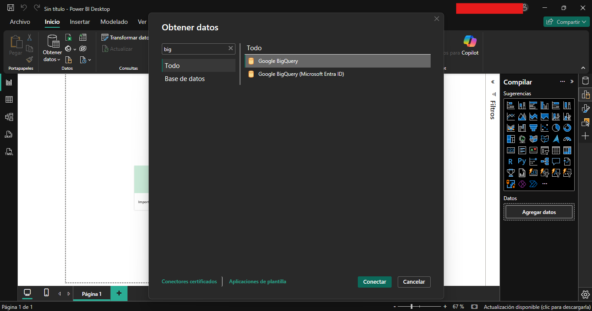
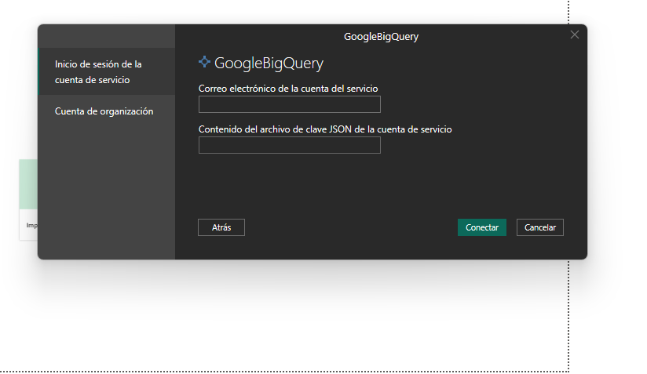
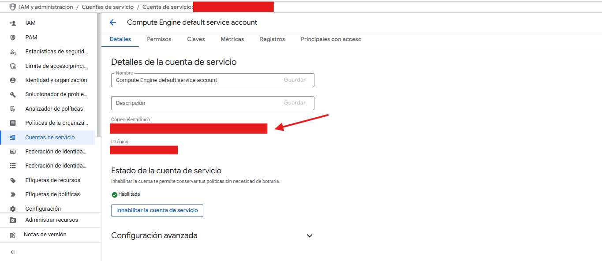
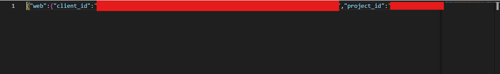
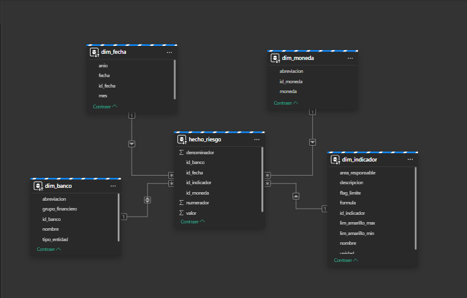
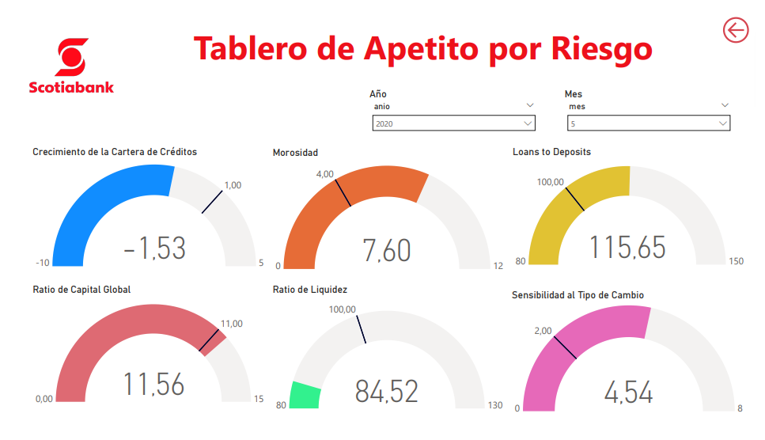
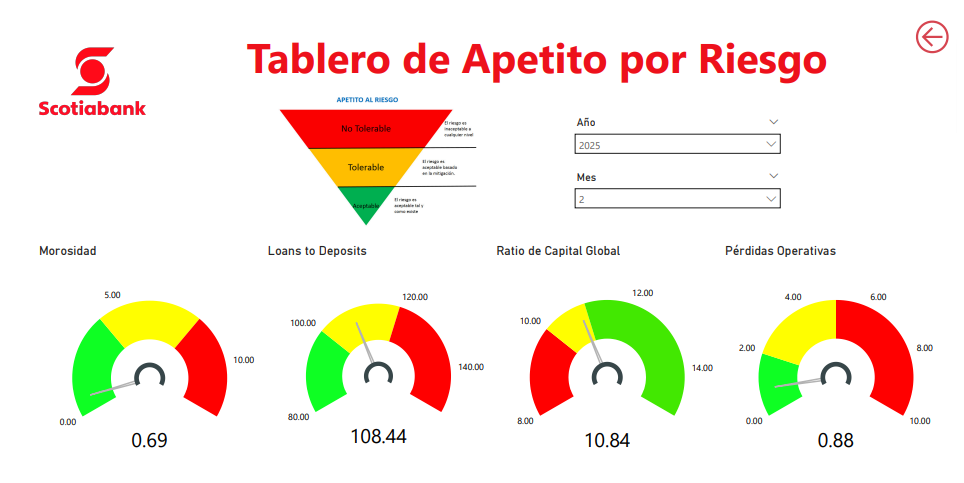
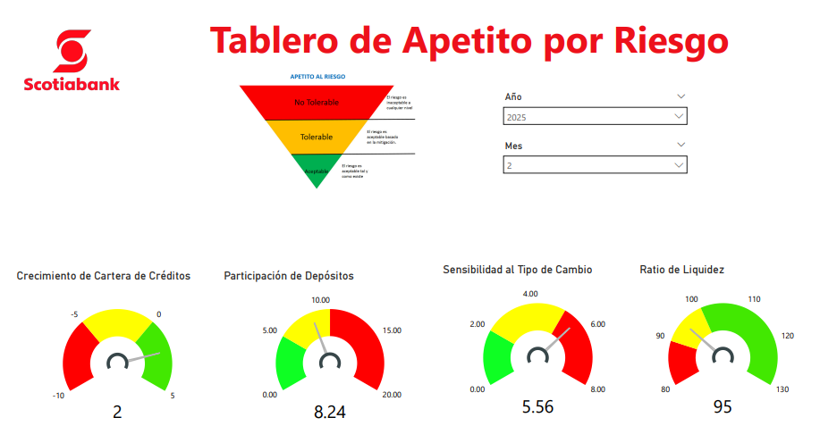
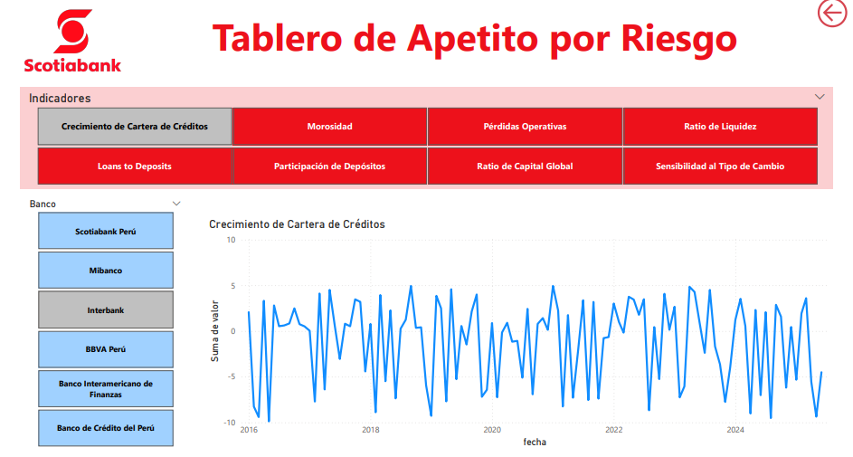
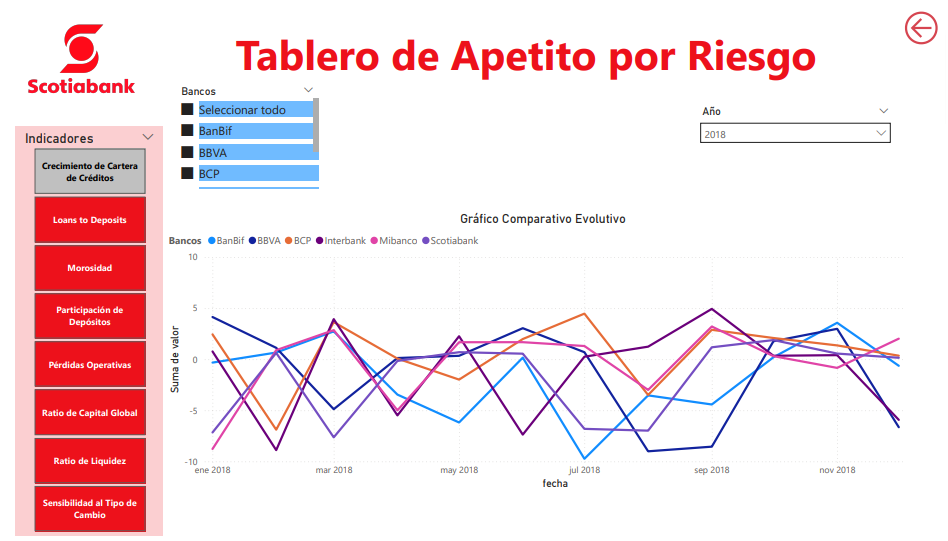

# 📊 Conexión de Power BI con Google BigQuery

Este módulo documenta el proceso de conexión entre Power BI Desktop y Google BigQuery, utilizando una Cuenta de Servicio como mecanismo seguro de autenticación. A partir de esta conexión se consumen los datos refinados del proyecto grupo6-scotiabank, permitiendo la construcción del modelo semántico y dashboards analíticos.

## 🛠️ 1. Inicio del proceso de conexión

Abrimos Power BI Desktop y seleccionamos:

Esto permite reconocer la infraestructura de Google Cloud como origen de datos.

## 🔐 2. Cuenta de Servicio configurada en GCP

La Cuenta de Servicio previamente creada en Google Cloud IAM contiene los permisos necesarios para leer datasets y ejecutar consultas en BigQuery.

- No requiere credenciales personales

- Permite control granular desde IAM

- Facilita el acceso automatizado sin renovación constante de tokens

Power BI solicita el archivo JSON correspondiente a la cuenta de servicio.
Este archivo contiene todos los campos necesarios para validar la identidad del cliente ante GCP.
Es necesario juntar todo el json en una sola linea al ingresar las credenciales:

## 🔑 3. Ingreso de credenciales en Power BI

Luego de seleccionar el archivo .json, Power BI valida las credenciales e inicia la conexión con los servicios de BigQuery.

## 📁 4. Elección del dataset y tablas

Una vez establecida la conexión, Power BI muestra los:

- Proyectos disponibles

- Datasets cargados en BigQuery

- Tablas listas para modelado

## 📅 5. Relación del modelo estrella de tablas en Power BI

Se mantiene genera una relación del modelo estrella de 1 a muchos de la tablas de dimensiones hacia la tabla de eventos.

## 📈 6. Dashboard final

Con el esquema relacional habilidato se desarrollaron las siguientes vistas de los indicadores:

## ♻️7. Reproducibilidad

Para poder replicar y hacer uso del dashboard generado, descargar el archivo ubicado en [docs](..\docs\README.md), establecer la conexión de la fuente de datos de BigQuery vista en los pasos 1,2,3 y 4.

Generar el modelo estrella de la parte 5.

