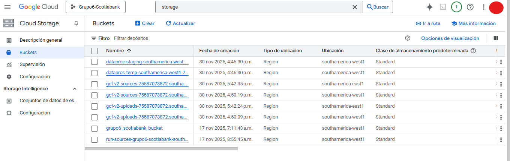
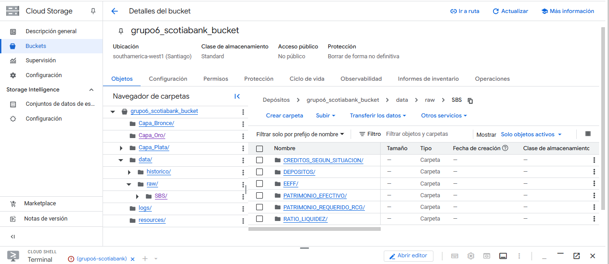
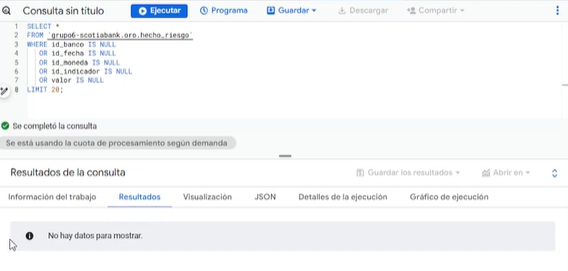
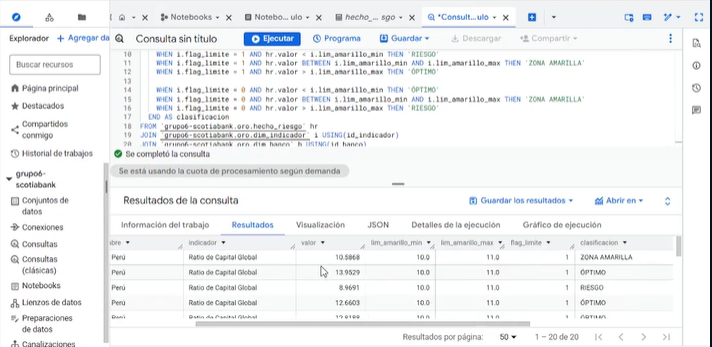
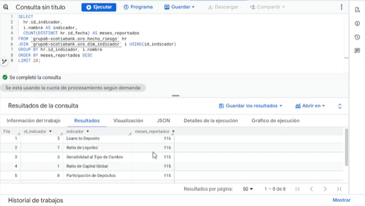
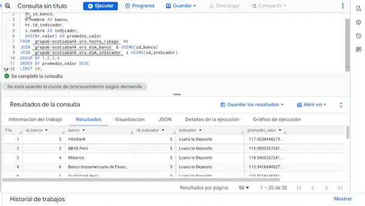
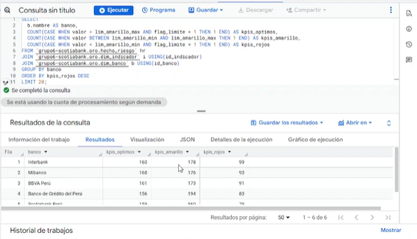

#  🏦 Proyecto BI Scotiabank 
## 🏗️ PC4 – Arquitectura Analítica en la Nube con Google Cloud Platform
El objetivo de este trabajo es implementar un flujo funcional de sistema de inteligencia de Negocio en la nube para la empresa Scotiabank que permitira:
- ✔ Obtener datos desde la web
- ✔ Procesarlos y almacenarlos en un Data Lake multicapa
- ✔ Transformarlos con PySpark
- ✔ Consolidar información en BigQuery
- ✔ Generar un esquema estrella en BigQuery
- ✔ Visualizar dashboards en Power BI

Información de implementación estructurada de recursos GCP en 👉 [IMPLEMENTACION.md](01_Ambiente_GCP/IMPLEMENTACION.md)


### Estructura de Carpetas

```json
/PC4
 ├── README.md                 # Documentación principal (este archivo)
 ├── 01_Ambiente_GCP/          # Creación del proyecto, IAM, VPC, buckets, claves
 ├── 02_WebScraping/           # Código Python para extracción de datos
 ├── 03_ETL/                   # Limpieza, consolidación, CSV, carga autom.
 ├── 04_DataLake/              # Raw / Trusted / Refined en GCS
 ├── 05_Procesamiento_Spark/   # Dataproc, PySpark, notebooks
 ├── 06_BigQuery/              # Tablas, consultas SQL
 ├── 07_PowerBI/               # Conexión con BigQuery + dashboards
 ├── Evidencias_Generales/     # Capturas, videos, PR, merges
 └── docs/                     
```
## 🧱 1. Arquitectura Avanzada en la Nube

Arquitectura desplegada sobre Google Cloud Platform (GCP) en el proyecto:

```
ID del Proyecto: grupo6-scotiabank
```

La solución integra servicios básicos, avanzados y complementarios para soportar un flujo completo de analítica de datos, desde la ingesta hasta el consumo en Power BI.

### ✔️ Servicios utilizados y evidencias de costos

Durante la implementación se hizo uso de los siguientes servicios en la nube:

| Servicio                 | Rol dentro de la Arquitectura                                       |
|--------------------------|----------------------------------------------------------------------|
| **Networking**           | Comunicación segura entre servicios, gestión de VPC, subredes y rutas privadas |
| **BigQuery**             | Motor analítico central para consultas SQL, creación de datasets y capas trusted/refined |
| **BigQuery Reservation** | Reserva de slots para consultas de alto rendimiento y procesamiento optimizado |
| **Dataproc**             | Procesamiento distribuido mediante PySpark para ETL y preparación de datos |
| **Compute Engine**       | Nodo de soporte y ejecución de tareas auxiliares o procesos puntuales |
| **Cloud Storage**        | Data Lake multicapa (raw → trusted → refined) para almacenamiento estructurado y no estructurado |
| **Cloud Run**            | Ejecución de servicios serverless para microcomponentes y automatización |
| **Cloud Run Functions**  | Funciones event-driven para orquestación y tareas desencadenadas por eventos |
| **Cloud Build**          | Construcción, empaquetado y despliegue automático de artefactos y pipelines |
                            


### ✔️ Storage estructurado (raw / trusted / refined)

La estrutura actual de Bucket en Cloud Storage tiene la siguiente forma



El Bucket Principal como Data Lake es el de **"grupo6_scotiabank_bucket"**.

Por otro lado se tiene Buckets adicionales generados automáticamente por los servicios y recursos utilizados:

- **dataproc-temp-southamerica-west1-..Dataproc** : Área temporal donde Dataproc guarda metadatos, logs, intermediarios y staging

- **gcf-v2-sources-75587073872-southamerica-west1	Cloud Run / Cloud Functions** : Almacena el código fuente desplegado por funciones y servicios serverless, permitiendo versionamiento y redeploy

El Data Lake se organizó bajo la estructura recomendada para arquitecturas analíticas:
```
gs://grupo6_scotiabank_bucket/   
│   ├── Capa Bronce/ # Datos originales tal como se ingresa (Capa Bronce, data/raw/SBS)
├───├── data/
│   │   ├── historico/  #Archivos Consolidados
│   │   └── raw/   # Datos Extraidos del Web Scraping
│   │       └── SBS/
│   │           ├── CREDITOS_SEGUN_SITUACION/
│   │           ├── DEPOSITOS/
│   │           ├── EEFF/
│   │           ├── PATRIMONIO_EFECTIVO/
│   │           ├── PATRIMONIO_REQUERIDO_RCG/
│   │           └── RATIO_LIQUIDEZ/
│   ├── logs/
│   └── resources/
├───└── Capa Plata/ # Datos curados, limpios y tipificados (Capa Plata, trusted)
└───└── Capa Oro/   # Datos listos para explotación analítica (Power BI / BigQuery, refined)
    
```



👉 Este reparto permite separar la capa principal de datos del código operacional, garantizando gobernanza y control de versiones.


### ✔️ Visor BI en la nube

El consumo analítico se realiza mediante:

Power BI conectado a BigQuery


Se empleó:

- 1 Cuenta de servicio (Service Account)

- 2 Conexión segura por credenciales JSON

- 3 Modelo importado/DirectQuery según necesidad

Esto garantiza acceso controlado a datasets refinados sin exponer usuarios finales a los servicios de GCP.

📘 Para más detalle, revisa [07_PowerBI](07_PowerBI/README.md)

### ✔️ Seguridad, IAM, roles y gobierno

La seguridad fue implementada mediante IAM granular por miembro del equipo y por servicio, asignando permisos mínimos necesarios para cada flujo.

📘 Para más detalle, revisa [01_Ambiente_GCP](01_Ambiente_GCP/README.md)

## 🔐 2. Seguridad, IAM, Redes y Gobernanza 

### ✔️ IAM y roles 

Tal como se desarrollo en [01_Ambiente_GCP](01_Ambiente_GCP/README.md), se establecieron roles y claves de acceso para la analítica y contrucion de reportes.

Los roles para cada usuario son ingresados a travez del CLI de GCP, estos estran granularizados en:


- Roles generales : Son los roles otorgados en general al proyecto
- Roles para Scraping y carga de datos : Permite el uso de servicios como Cloud Run, Cloud Funtions y la creación de buckets para guardar los datos
- Roles para Procesamiento y ETL: Permite la creacion de recursos dataprocserverles para procesar los recursos a travez de las capas bronce, plata y oro creando la tabla de hechos final.


### ✔️ Registro de Logs

Para la observabilidad, el servicio de Loggins de GCP esta activado por defecto. Aqui se puede visualizar las fallas generadas en la ejecución de flujos desarrollardos por Cloud Run, Cloud Functions, BigQuery, Jobs, entre otros.


## 🧩 5. Consultas SQL y Validación del Modelo de Riesgo

Esta sección documenta las validaciones ejecutadas sobre la tabla central de hechos hecho_riesgo y sus dimensiones asociadas dentro del Data Warehouse desarrollado en Google BigQuery.

📘 Evidencia de Validación en [06_BigQuery](06_BigQuery/README.md).

### 🔍 5.1 Validación de Calidad de Datos


#### **(Script 1) Validación de valores nulos críticos**
- Verifica la existencia de registros incompletos en las claves de negocio y campos numéricos.  
**Objetivo:** asegurar que no existan hechos sin referencia dimensional.



#### **(Script 2) Validación semántica contra límites definidos**
- Clasifica cada valor como **Óptimo / Amarillo / Riesgo** según los umbrales definidos para cada indicador.  
**Objetivo:** comprobar que los datos se interpretan correctamente antes de alimentar visualizaciones como semáforos o tacómetros en Power BI.




#### **(Script 3) Validación de cobertura temporal del dataset**
- Revisa que cada indicador tenga registros en múltiples periodos, evitando series incompletas.  
**Objetivo:** garantizar que los análisis evolutivos no tengan huecos que distorsionen el análisis.




### 📊 5.2 KPIs y Métricas Financieras

#### **(Script 4) KPI — Promedio histórico del indicador por banco**
- Calcula el valor medio de cada indicador por entidad bancaria.  
**Objetivo:** ofrecer una referencia sólida para evaluar el comportamiento relativo de cada banco.




#### **(Script 5) KPI — Tendencia mensual (variación porcentual)**
- Analiza la evolución del valor del indicador mes a mes usando funciones de ventana (`LAG`).  
**Objetivo:** identificar si la situación financiera del banco mejora o empeora en el tiempo.  


#### **(Script 6) KPI — Consolidado de salud financiera por banco**
- Resume la cantidad de indicadores en zonas **verde**, **amarilla** y **roja** para cada entidad financiera.  
**Objetivo:** facilitar una visión global del riesgo institucional y priorizar acciones preventivas.




Los resultados obtenidos a partir de estos scripts se encuentran documentados mediante:

✔ Tablas con resultados visibles  
✔ Video demostrativo del proceso  
✔ Scripts SQL subidos al repositorio


Con la ejecución validada de los scripts:

| Categoría | Scripts | Resultado |
|----------|---------|-----------|
| Calidad de datos | 1–3 | Dataset íntegro y consistente |
| KPIs financieros | 4–6 | Métricas confiables para análisis |

