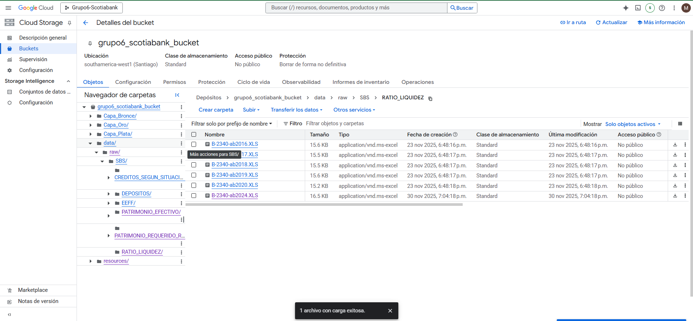
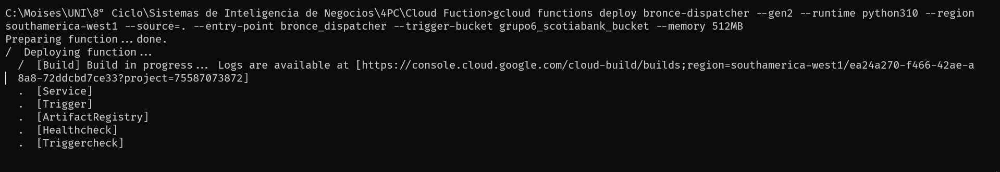
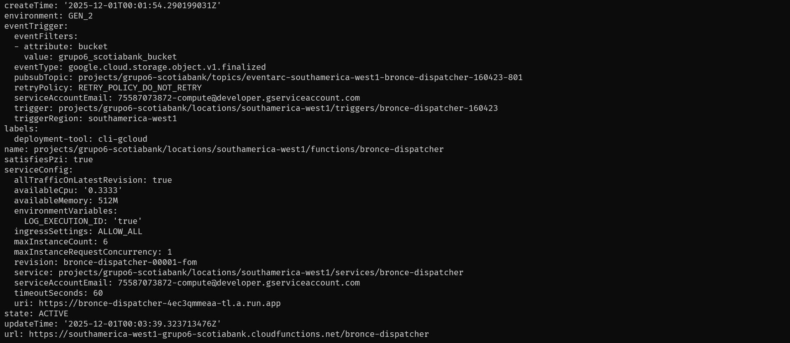
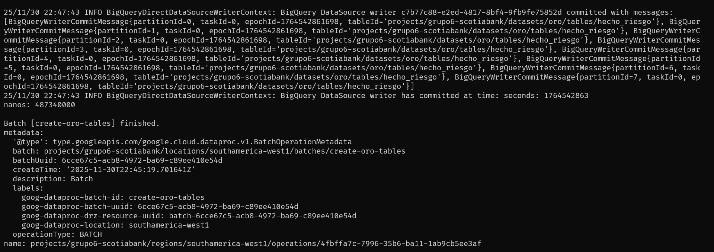
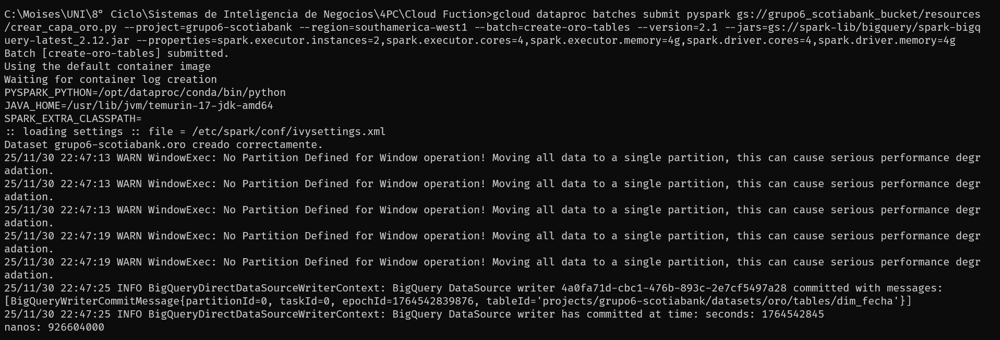

# 📁 **/resources - Cloud Function y Jobs PySpark**

La carpeta **`/resources`** contiene todos los componentes que permiten automatizar el procesamiento de datos dentro de la arquitectura Medallion (Bronce → Plata → Oro).

Aquí se encuentran:

* La **Cloud Function `bronce-dispatcher`**, que se activa ante nuevos archivos RAW en Cloud Storage.
* Los **jobs PySpark ejecutados en Dataproc**, encargados de procesar la capa Bronce, Plata y generar la capa Oro.
* El job especial `crear_capa_oro.py`, que inicializa las **dimensiones del modelo analítico Oro**.
* **Video explicativo** del proceso.

---

# 🗂️ **Estructura del directorio**

```
resources/
├── bronce-dispatcher/        # Cloud Function (ETL Bronce + orquestación)
│   ├── config/
│   │   └── paths.py          # Prefijos, rutas y configuración
│   ├── pipelines/            # Pipelines ETL por entidad
│   │   ├── bcrp/
│   │   │   └── tipo_cambio.py
│   │   └── sbs/
│   │       ├── creditos.py
│   │       ├── depositos.py
│   │       ├── patrimonio.py
│   │       └── ratio_liquidez.py
│   ├── utils/                # Lectura GCS y carga BigQuery
│   ├── main.py               # Dispatcher (entry point)
│   └── requirements.txt
│
└── jobs/                     # Scripts PySpark enviados a Dataproc
    ├── crear_capa_oro.py     # Crea tablas DIM y estructura Oro
    ├── jb_creditos.py
    ├── jb_depositos.py
    ├── jb_patrimonio.py
    ├── jb_ratio_liquidez.py
    └── jb_tipo_cambio.py
```

---

# ☁️ **Cloud Function: `bronce-dispatcher`**

La Cloud Function implementa el mecanismo automático de ingesta:

## 🔄 ¿Cómo funciona?

1. Detecta un archivo nuevo en el bucket:

   ```
   gs://grupo6_scotiabank_bucket/data/raw/...
   ```
2. Identifica el pipeline según el prefijo (ratio, depósitos, créditos, patrimonio…)
3. Llama al pipeline correspondiente:

   * Lee Excel/CSV
   * Limpia y transforma
   * Carga a BigQuery (Bronce)
4. Lanza automáticamente un **job PySpark (Dataproc)** para procesar la capa Plata → Oro.

### Vista del bucket GCS



---

# 🚀 **Despliegue de la Cloud Function**

Cuando se hacen cambios en `bronce-dispatcher`, la función se despliega a GCP con:

```bash
gcloud functions deploy bronce-dispatcher \
  --gen2 \
  --runtime python310 \
  --region southamerica-west1 \
  --source=. \
  --entry-point bronce_dispatcher \
  --trigger-bucket grupo6_scotiabank_bucket \
  --memory 512MB
```

### Subida de la Cloud Function



### Cloud Function cargada



> Este comando empaqueta toda la carpeta `bronce-dispatcher/` y la sube a GCP.

---


# 🔥 **Jobs PySpark en Dataproc**

Cada pipeline ETL (Bronce) dispara automáticamente un job PySpark que procesa:

* **Plata:** limpieza profunda y armonización
* **Oro:** construcción del modelo analítico

Los jobs se encuentran en:

```
/resources/jobs/
```

### Los jobs disponibles son:

| Job                     | Rol                                                |
| ----------------------- | -------------------------------------------------- |
| `jb_ratio_liquidez.py`  | Procesa ratio de liquidez                          |
| `jb_depositos.py`       | Procesa depósitos SBS                              |
| `jb_creditos.py`        | Procesa créditos SBS                               |
| `jb_patrimonio.py`      | Procesa patrimonio SBS                             |
| `jb_tipo_cambio.py`     | Procesa tipo de cambio BCRP                        |
| **`crear_capa_oro.py`** | *Job especial: crea dimensiones de la capa Oro* |

---

# 🏗️ **Job especial: Crear estructura de la Capa Oro**

Antes de ejecutar cualquier job analítico, es necesario crear:

✔ `dim_fecha`
✔ `dim_banco`
✔ `dim_moneda`
✔ `dim_indicador`
✔ Estructura base de `hecho_riesgo`

Este proceso se ejecuta una vez o cuando se quiera reiniciar la capa oro.

---

## ▶️ Ejecución del job para crear la Capa Oro

Usa el siguiente comando:

```bash
gcloud dataproc batches submit pyspark \
  gs://grupo6_scotiabank_bucket/resources/crear_capa_oro.py \
  --project=grupo6-scotiabank \
  --region=southamerica-west1 \
  --batch=create-oro-tables \
  --version=2.1 \
  --jars=gs://spark-lib/bigquery/spark-bigquery-latest_2.12.jar \
  --properties=spark.executor.instances=2,spark.executor.cores=4,spark.executor.memory=4g,spark.driver.cores=4,spark.driver.memory=4g
```

### Cargando job capa oro



### Ejecutando job capa oro



---


# 🎬 **Explicación del proceso**

Si quieres ver el proceso detallado, puedes ver el siguiente video:

[](https://youtu.be/IdxF6J1P_q0)